# Lời nói đầu

Cuốn sách này được biên tập từ mạch học Wyckoff/VSA đã diễn ra trong dự án: các bài giảng, câu hỏi, phản biện, bài tập, phần chữa bài và những nguyên tắc được hoàn thiện dần qua quá trình học. Mục tiêu không phải tạo một từ điển mẫu hình, mà giúp người đọc hình thành một quy trình suy luận có thể dùng trên biểu đồ thật.

Trục tư duy xuyên suốt là:

> **Bối cảnh → giá → Spread → Volume → Effort/Result → Supply/Demand → phản ứng → xác nhận → kịch bản → hành động.**

Một tín hiệu chỉ được xem là có ý nghĩa khi đặt đúng vị trí trong cấu trúc và được thị trường xác nhận. Người đọc được khuyến khích quan sát trước, mô tả trước, rồi mới gắn nhãn sau.

## Phạm vi nguồn

Bản này chỉ sử dụng nội dung đã có trong nguồn khóa học hiện truy cập được và các nội dung đã được duyệt trong quá trình biên tập. Những chủ đề chỉ mới được liệt kê nhưng chưa được giảng đủ sâu sẽ được đánh dấu rõ là **chưa đủ nguồn**, thay vì tự bổ sung kiến thức ngoài khóa học.

## Quy ước biểu đồ

- Nến tăng: thân trắng/rỗng, viền đen.
- Nến giảm: thân đen hoặc xám rất đậm.
- Spread: khoảng High − Low của bar.
- Volume nằm ngay dưới giá khi cần phân tích Effort.
- Hỗ trợ/kháng cự là **vùng**, không phải một đường tuyệt đối.
- Các hình mang dòng “Sơ đồ mô phỏng sư phạm” là hình khái niệm, không phải dữ liệu thị trường thực.
- Với bài tập, đáp án không được đặt trên hình.

## Cách sử dụng cuốn sách

Đọc lần đầu theo thứ tự. Khi gặp bài tập, hãy che phần lời giải và tự trả lời theo trình tự: bối cảnh → vị trí → giá/Spread → Volume → Effort/Result → Supply/Demand → xác nhận → hành động. Khi đọc lại, có thể dùng bảng thuật ngữ và các checklist ở cuối sách để tra cứu nhanh.

# PHẦN I — HỌC CÁCH NHÌN THỊ TRƯỜNG

# Chương 1 — Sống sót trước khi kiếm tiền

## Mục tiêu chương

Thiết lập tư duy nền: bảo toàn vốn, phân biệt chất lượng quyết định với kết quả một lệnh và giao dịch bằng kịch bản thay vì hy vọng.

Người mới thường hỏi “làm sao kiếm nhiều tiền?”. Khóa học đổi câu hỏi thành “làm sao tồn tại đủ lâu để trở thành trader có năng lực?”. Mạch học đã hình thành nguyên tắc: **sống sót → bảo toàn vốn → tích lũy kinh nghiệm → xây dựng hệ thống → sau đó mới tối ưu lợi nhuận**.

## 1. Thiếu kiến thức khác với thiếu kỷ luật

Một người chưa biết cấu trúc, chưa hiểu điểm vào/ra và chưa có hệ thống rõ ràng không thể chỉ bị quy kết là “thiếu kỷ luật”. Kỷ luật có ý nghĩa khi đã có một quy trình hợp lý để tuân thủ. Vì vậy sách ưu tiên xây khả năng quan sát và suy luận trước, rồi mới yêu cầu thực hiện nhất quán.

## 2. Kịch bản thay cho dự đoán

Không cần tuyên bố giá chắc chắn tăng hay giảm. Ta xây các khả năng: breakout được chấp nhận thì giữ/mua; breakout thất bại thì phòng thủ; Spring candidate thì chờ Demand; breakdown được chấp nhận thì thoát. Trader không cần biết trước tương lai, nhưng phải biết mình sẽ làm gì khi từng kịch bản xuất hiện.

## 3. Một giao dịch tốt vẫn có thể thua

Nếu bối cảnh hợp lý, điểm vào có bằng chứng, R:R chấp nhận được và điểm vô hiệu được tuân thủ, một lệnh thua vẫn có thể là quyết định đúng quy trình. Ngược lại, một lệnh mua tùy tiện rồi may mắn tăng không biến quy trình tồi thành quy trình tốt.

## 4. Không giao dịch cũng là hành động

Giữa Trading Range, khi cấu trúc chưa rõ hoặc điểm vô hiệu quá xa, kết luận đúng có thể là **chưa hành động**. Không đặt vốn vào nơi mình chưa hiểu là một kỹ năng, không phải bỏ lỡ.

## Sai lầm thường gặp

- **Coi mỗi lệnh là bài kiểm tra bản thân** Mục tiêu là thực hiện đúng kế hoạch, không phải chứng minh mình đúng.
- **Dời điểm vô hiệu vì hy vọng** Khi luận điểm bị phủ định, giữ lệnh chỉ làm rủi ro tăng.
- **Đồng nhất thắng lệnh với phân tích giỏi** Một kết quả đơn lẻ không đánh giá được chất lượng quy trình.

## Checklist áp dụng

- Trước lệnh đã có kịch bản A/B/C chưa?
- Điều gì làm nhận định sai?
- Nếu sai, mức lỗ có nằm trong khả năng chịu đựng?
- Nếu chưa đủ bằng chứng, có thể không giao dịch không?

## Bài tập

Viết hai kế hoạch cho cùng một cổ phiếu: một kế hoạch nếu breakout thành công và một kế hoạch nếu breakout thất bại. Không dự đoán kịch bản nào chắc chắn xảy ra.

## Lời giải và cách suy luận

Một câu trả lời đạt yêu cầu phải có điều kiện kích hoạt, hành động và điều kiện vô hiệu cho cả hai kịch bản; không dùng các câu như “chắc chắn tăng”.

## Tóm tắt chương

- Bảo toàn vốn đứng trước tối ưu lợi nhuận.
- Chất lượng quyết định khác kết quả một lệnh.
- Thị trường có quyền chứng minh ta sai.
- Không giao dịch cũng là quyết định hợp lệ.

# Chương 2 — Bối cảnh trước tín hiệu

## Mục tiêu chương

Loại bỏ thói quen nhìn từng cây nến độc lập và xây thứ tự quan sát từ cấu trúc lớn đến tín hiệu nhỏ.

Bối cảnh là góc nhìn xa, tín hiệu là góc nhìn gần. Cùng một nến và cùng một mức Volume có thể mang ý nghĩa trái ngược nếu xuất hiện ở vị trí khác nhau.

## 1. Bốn tầng bối cảnh

Tầng 1: xu hướng và pha Wyckoff. Tầng 2: vị trí — support, resistance, giữa Range, breakout hay retest. Tầng 3: Price + Spread + Close + Wick + Volume. Tầng 4: phản ứng sau tín hiệu. Không nên bỏ qua tầng trên để nhảy thẳng tới tên mẫu hình.

## 2. Cùng một nến, hai ý nghĩa

Một nến giảm Spread hẹp, Volume thấp sau SOS và tại support có thể cho thấy Supply yếu. Cùng hình dạng sau SOW, dưới support vừa mất có thể chỉ cho thấy môi trường thiếu Demand. Hình dạng gần giống nhưng background khác.

## 3. Vị trí quyết định chất lượng giao dịch

Một cây Demand mạnh ở rất xa nền có thể xác nhận Strength nhưng lại là điểm mua R:R kém. Phân tích tín hiệu đúng không đồng nghĩa với việc phải giao dịch tại chính cây đó.

## 4. Tên sự kiện đến sau bằng chứng

LPS cần Strength/SOS trước đó; LPSY cần Weakness/SOW; Spring cần Trading Range và rejection phía dưới; UTAD cần bối cảnh phân phối. Không gắn tên chỉ vì hình dạng giống mẫu.

## Sai lầm thường gặp

- **Nến đẹp = mua** Bỏ qua cấu trúc và vị trí.
- **Break support = breakdown** Có thể là Spring/Shakeout nếu giá bị từ chối phía dưới.
- **Break resistance = breakout** Có thể là UT nếu giá không được chấp nhận phía trên.

## Checklist áp dụng

- Trước đó là Markup, Markdown hay Range?
- Giá ở đâu trong cấu trúc?
- Tín hiệu có phù hợp với pha Wyckoff không?
- Follow-through xác nhận hay phủ định?

## Bài tập

Lấy cùng một nến giảm Spread hẹp và tự viết hai bối cảnh khiến nó có ý nghĩa khác nhau.

## Lời giải và cách suy luận

Một phương án hợp lý: sau SOS gần support → Supply yếu; sau SOW khi rally thất bại → Demand yếu. Điểm được chấm nằm ở bối cảnh, không phải tên gọi.

## Tóm tắt chương

- Bối cảnh quyết định cách diễn giải tín hiệu.
- Vị trí có thể quan trọng ngang hình dạng bar.
- Tên Wyckoff là kết luận sau bằng chứng, không phải điểm bắt đầu.

# Chương 3 — Đọc nến và Spread

## Mục tiêu chương

Đọc được Open, High, Low, Close; phân biệt Spread với thân nến; mô tả Result mà chưa vội gắn nhãn Wyckoff.

Nến là dấu vết của quá trình đấu giá. Ta quan sát giá đã đi bao xa, vùng nào bị từ chối và Result được giữ tới đâu ở Close.

## 1. Spread là High − Low

Spread là toàn bộ biên dao động, không phải riêng thân Open–Close. Một nến thân nhỏ nhưng hai wick dài vẫn có Spread rộng. Spread rộng cho biết khoảng di chuyển lớn; Spread hẹp cho biết giá tiến ít, nhưng chưa tự nói Strength hay Weakness.

## 2. Close cho biết Result được giữ tới đâu

Close gần High nghĩa là phần lớn Result phía trên được giữ đến cuối bar; Close gần Low cho thấy Result giảm được giữ. Nhưng phải đặt vào bối cảnh: close gần High sau nền có thể là SOS, còn sau Markup dựng đứng có thể là Buying Climax candidate.

## 3. Wick là dấu hiệu rejection, không phải nhãn

Râu dưới cho biết mức thấp từng được giao dịch nhưng không được giữ trọn; râu trên tương tự với mức cao. Râu dưới không tự động là Spring, râu trên không tự động là UT.

## 4. Đọc chuỗi nến thay vì một nến

Một pullback có Spread và mức giảm co dần, rồi xuất hiện bar tăng Spread rộng close cao sẽ kể câu chuyện Supply suy yếu rồi Demand quay lại rõ hơn việc cố đặt tên từng cây riêng lẻ.

## Sai lầm thường gặp

- **Nến xanh = Demand** Close > Open chưa đủ chứng minh Demand kiểm soát.
- **Nến đỏ = Supply** Có thể là Test với Supply rất thấp.
- **Râu dài = tín hiệu Wyckoff** Wick chỉ cho biết rejection ở mức nào đó.

## Checklist áp dụng

- Spread rộng hay hẹp so với các bar gần nhất?
- Close nằm ở High/giữa/Low?
- Wick ở phía nào?
- Bar này tạo Result tăng hay giảm?
- Chưa có Volume thì chỉ mô tả, chưa kết luận quá mức.

## Bài tập

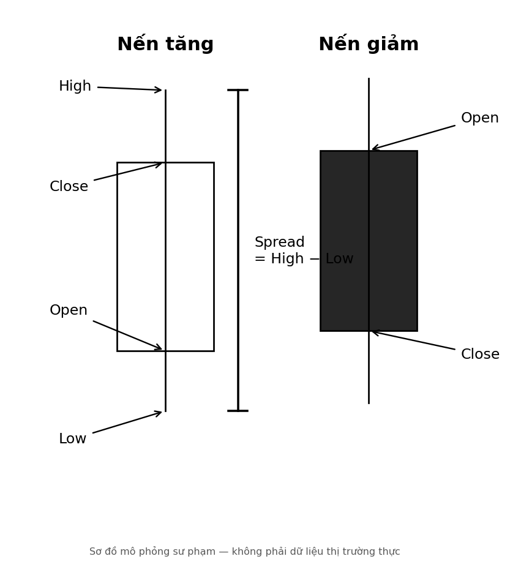

*Hình 3.1 — Cấu tạo nến và Spread*

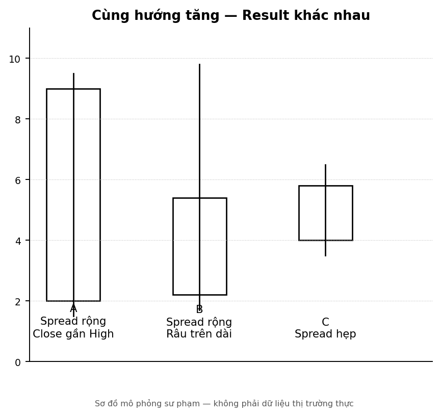

*Hình 3.2 — Cùng hướng tăng nhưng Result khác nhau*
Quan sát thêm hình bài tập ở cuối phần thực hành: sáu cây nến không có Volume. Hãy mô tả Spread, Close và rejection trước khi gắn bất kỳ nhãn Wyckoff nào.

## Lời giải và cách suy luận

Không có một đáp án ‘mua/bán’ cho bài này. Mục tiêu là mô tả khách quan: A Spread rộng close cao; B có rejection phía trên; v.v. Chỉ khi có bối cảnh và Volume mới tiến tới Supply/Demand.

## Tóm tắt chương

- Spread = High − Low.
- Close cho biết Result được giữ tới đâu.
- Wick cho biết rejection, không tự động là tín hiệu.
- Mô tả trước, diễn giải sau.

# PHẦN II — NGÔN NGỮ PRICE, SPREAD, VOLUME VÀ CUNG CẦU

# Chương 4 — Volume không phải tín hiệu mua bán

## Mục tiêu chương

Bỏ các phản xạ máy móc Volume cao/thấp = tốt/xấu và hiểu Volume như mức Effort cần được so với Result.

Volume trước hết cho biết mức độ tham gia/giao dịch. Nó không trực tiếp nói ai thắng. Muốn biết Supply hay Demand kiểm soát phải nhìn Price, Spread, Close, vị trí và follow-through.

## 1. Volume lớn chỉ nói Effort lớn

Giá tăng và Volume lớn có thể là Demand hiệu quả, nhưng cũng có thể là Demand bị Supply hấp thụ. Volume cao + Spread hẹp đặc biệt đáng chú ý vì rất nhiều giao dịch nhưng giá không đi xa.

## 2. Volume thấp cũng không có nghĩa cố định

Trong pullback sau Strength, Volume giảm có thể cho thấy Supply yếu. Trong rally sau Weakness, Volume thấp lại có thể phản ánh Demand yếu. Hướng di chuyển và background quyết định ý nghĩa.

## 3. Breakout không bắt buộc Volume cực lớn

Nếu Supply đã được hấp thụ trước đó, một breakout với Volume vừa phải vẫn có thể tốt nếu giá vượt, close cao và được chấp nhận phía trên. Ngược lại Volume cực lớn mà Result kém và quay lại Range là đáng nghi.

## 4. So sánh tương đối

Không hỏi ‘2 triệu cổ phiếu có cao không?’ mà hỏi so với các bar gần đây, các lần test trước và bar có cùng chức năng cấu trúc. ST nên so với SC; Test nên so với Spring; LPS nên so với pullback trước.

## Sai lầm thường gặp

- **Volume tăng = mua** Không biết Result thì chưa biết ai thắng.
- **Volume thấp = hết cung** Có thể chỉ là thiếu Demand.
- **Breakout phải Volume thật lớn** Supply cạn có thể khiến Effort vừa phải tạo Result lớn.

## Checklist áp dụng

- Volume cao/thấp so với bar nào?
- Spread và Close tương ứng ra sao?
- Result có tương xứng Effort?
- Vị trí là support/resistance/breakout/retest?
- Các bar sau xác nhận gì?

## Bài tập

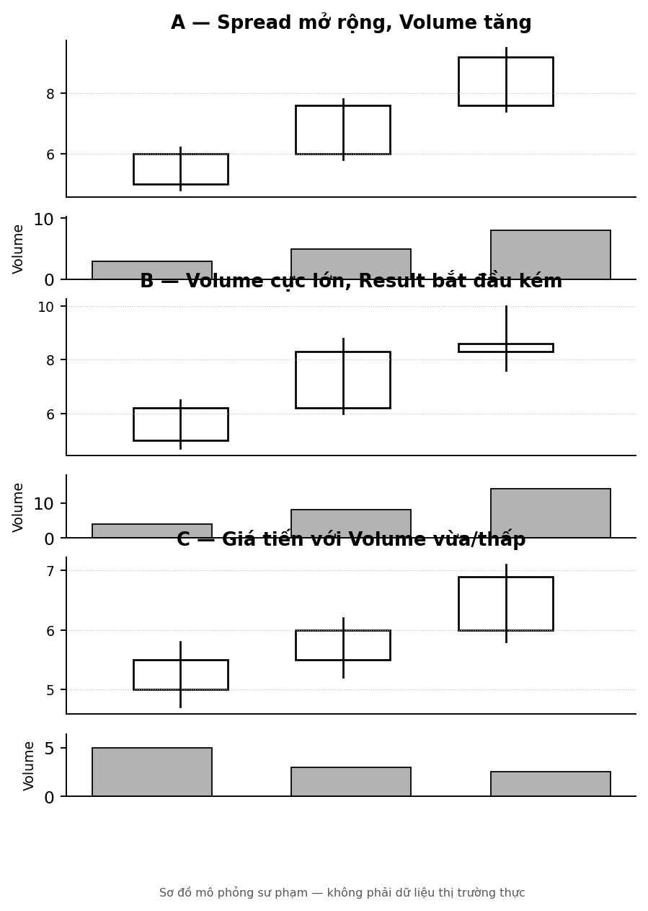

*Hình 4.1 — Cùng hướng giá nhưng Volume khác nhau*

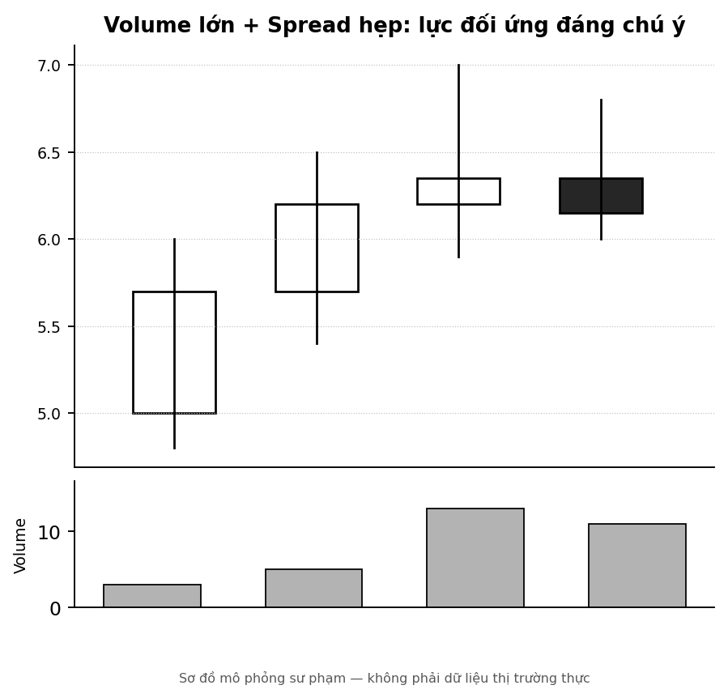

*Hình 4.2 — Volume lớn + Spread hẹp*
Với từng cụm, chỉ ra Effort lớn hay nhỏ và Result có tương xứng không. Chưa cần gắn nhãn Spring/SOS.

## Lời giải và cách suy luận

A có Effort và Result cùng tăng; B cho thấy Effort rất lớn nhưng Result bắt đầu kém; C cho thấy giá vẫn có thể tiến với Effort vừa/thấp khi cản ít. Hình 4.2 là trường hợp phải chờ follow-through.

## Tóm tắt chương

- Volume = Effort, không phải tín hiệu mua/bán.
- Volume cao/thấp chỉ có ý nghĩa khi so với Price/Spread.
- Acceptance và follow-through quan trọng hơn một cột Volume đơn lẻ.

# Chương 5 — Effort vs Result

## Mục tiêu chương

Ghép Volume với mức di chuyển của giá để phát hiện khi một bên bỏ nhiều Effort nhưng không tạo được Result tương xứng.

Đây là nguyên lý trung tâm của VSA trong khóa học: **Effort = Volume; Result = mức độ di chuyển của giá + Spread + Close + khả năng tiếp diễn**. Nỗ lực lớn nhưng kết quả nhỏ buộc ta đặt câu hỏi về lực đối ứng.

## 1. Bốn trạng thái cơ bản

Effort lớn + Result lớn: nỗ lực đang hiệu quả. Effort lớn + Result nhỏ: có lực đối ứng/absorption đáng chú ý. Effort nhỏ + Result nhỏ: ít hoạt động. Effort nhỏ + Result lớn: cản ít, nên một lực vừa phải cũng đủ đẩy giá.

## 2. Không đánh giá bằng một bar

Một bar Volume lớn Spread hẹp chỉ nói lực đối ứng mạnh; chưa biết bên nào thắng. Cần quan sát bar tiếp theo và vị trí cấu trúc. Sau Markdown, trạng thái này có thể đi tới stopping action; sau Markup có thể là phân phối.

## 3. Result còn gồm khả năng giữ kết quả

Breakout vượt resistance nhưng quay lại ngay là Result kém hơn breakout cùng mức tăng nhưng giữ phía trên. Vì vậy acceptance/follow-through là phần của Result chứ không phải chi tiết phụ.

## Sai lầm thường gặp

- **Effort lớn = Strength** Không; có thể là đấu tranh lớn.
- **Spread rộng = hiệu quả** Phải xem Close và khả năng tiếp diễn.
- **Kết luận absorption từ một bar** Absorption là quá trình, cần nhiều lần thử và kết quả sau đó.

## Checklist áp dụng

- Effort cao/thấp?
- Result lớn/nhỏ?
- Result được giữ hay bị đảo ngược?
- Ai đang mất hiệu quả qua nhiều lần thử?

## Bài tập

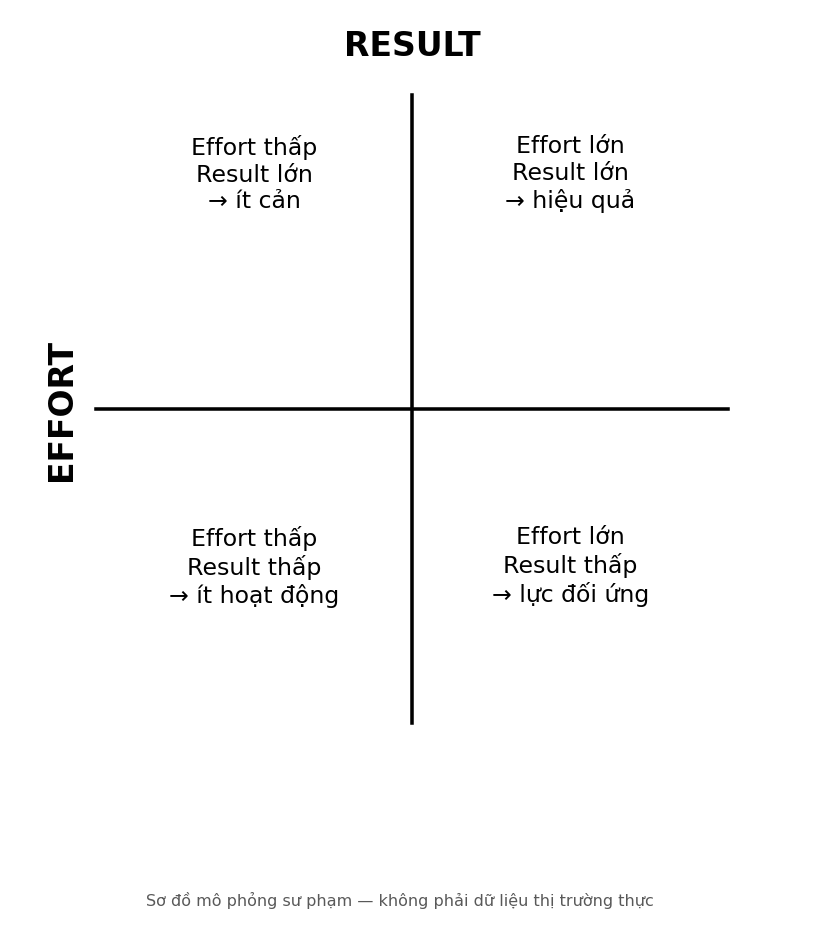

*Hình 5.1 — Ma trận Effort và Result*
Hãy đặt bốn ví dụ trong khóa học vào bốn ô: SC candidate, SOS, BC candidate, Absorption.

## Lời giải và cách suy luận

Không có ánh xạ một-một. SC/BC thường cần context; SOS thường là Effort tạo Result và được chấp nhận; absorption thường nằm ở ô Effort lớn/Result kém qua một quá trình.

## Tóm tắt chương

- Effort phải được so với Result.
- Result bao gồm Spread, Close và follow-through.
- Effort lớn/Result nhỏ là tín hiệu đặt câu hỏi, không phải đáp án.

# Chương 6 — Supply, Demand và lực đối ứng

## Mục tiêu chương

Chuyển từ mô tả Price/Volume sang câu chuyện bên nào đang tạo áp lực và bên nào đang mất hiệu quả.

Supply/Demand trong cuốn sách không được suy ra từ màu nến. Ta quan sát hiệu quả của các nhịp giảm và nhịp tăng, mức Volume đi kèm và phản ứng ở những vùng cấu trúc quan trọng.

## 1. Supply mạnh

Supply được xem là có hiệu quả khi nhịp giảm mở rộng, Close yếu, hỗ trợ bị phá và giá được chấp nhận ở vùng thấp. Supply xuất hiện nhưng giá không giảm được tương xứng có thể đang bị Demand hấp thụ.

## 2. Demand mạnh

Demand có hiệu quả khi rally tạo progress tốt, Close cao, resistance bị phá và giá giữ được phía trên. Demand nhiều nhưng giá không tiến được có thể đang bị Supply hấp thụ.

## 3. Sức mạnh là quan hệ, không phải nhãn cố định

Một bên mạnh khi bên kia không thể tạo Result. Vì vậy các câu hỏi hữu ích là: ai vừa thắng? bên thua phản công ra sao? phản công mạnh lên hay yếu đi?

## Sai lầm thường gặp

- **Thấy nến đỏ = Supply mạnh** Không xem Effort/Result và vị trí.
- **Thấy nến xanh = Demand mạnh** Có thể là rally yếu trong Markdown.
- **Cố đoán Smart Money** Ưu tiên đọc hành vi có thể quan sát thay vì gán động cơ chắc chắn.

## Checklist áp dụng

- Nhịp tăng/giảm tạo progress thế nào?
- Mỗi lần test cùng vùng Result mạnh lên hay yếu đi?
- Bên phản công có Volume/Spread như thế nào?
- Ai đang dần mất hiệu quả?

## Bài tập

Tự mô tả một chuỗi trong đó Supply xuất hiện nhiều nhưng mỗi lần chỉ đẩy giá xuống ít hơn.

## Lời giải và cách suy luận

Chuỗi đó phù hợp với giả thuyết Supply bị hấp thụ, nhưng chỉ được nâng độ tin cậy khi Demand tạo breakout/SOS và giữ Result.

## Tóm tắt chương

- Supply/Demand được đọc qua hiệu quả, không qua màu nến.
- Bên mất hiệu quả lặp lại có thể đang bị hấp thụ.
- Phản ứng sau tín hiệu giúp xác định ai thắng.

# PHẦN III — TRADING RANGE VÀ CHU KỲ WYCKOFF

# Chương 7 — Support, Resistance và Trading Range

## Mục tiêu chương

Hiểu hỗ trợ/kháng cự như vùng chiến đấu và dùng vị trí trong Range để cải thiện R:R và cách đọc tín hiệu.

Không có một mức giá duy nhất mà toàn bộ người mua/bán cùng hành động. Vì vậy hỗ trợ và kháng cự được xem là vùng. Một wick xuyên nhẹ không đồng nghĩa cấu trúc đã bị phá.

## 1. Ba vị trí trong Range

Biên dưới thuận lợi để đánh giá rejection/Spring/Test; biên trên để đánh giá breakout/UT; giữa Range thường có ít lợi thế vì khoảng cách tới cả hai biên không đẹp.

## 2. Phá vùng khác với chạm vùng

Breakdown đáng tin hơn khi Spread rộng, Volume phù hợp, Close gần Low và các phiên sau tiếp tục nằm dưới hỗ trợ. Nếu phá nhẹ rồi quay lại nhanh, đó có thể là rejection/Spring candidate.

## 3. Acceptance và Rejection

Acceptance là thị trường tiếp tục giao dịch ở phía bên kia vùng vừa phá. Rejection là vượt qua nhưng không giữ được. Cặp khái niệm này sẽ được dùng lại trong Spring/Breakdown và Breakout/UT.

## Sai lầm thường gặp

- **Hỗ trợ là một đường tuyệt đối** Dễ bị wick nhỏ đánh lừa.
- **Mua giữa Range** R:R thường kém và cấu trúc chưa có lợi thế.
- **Một bar phá = phá thật** Cần acceptance/follow-through.

## Checklist áp dụng

- Đang ở biên dưới, giữa hay biên trên?
- Phá vùng có được chấp nhận?
- Kháng cự cũ có trở thành hỗ trợ?
- Vị trí hiện tại cho phép invalidation hợp lý không?

## Bài tập

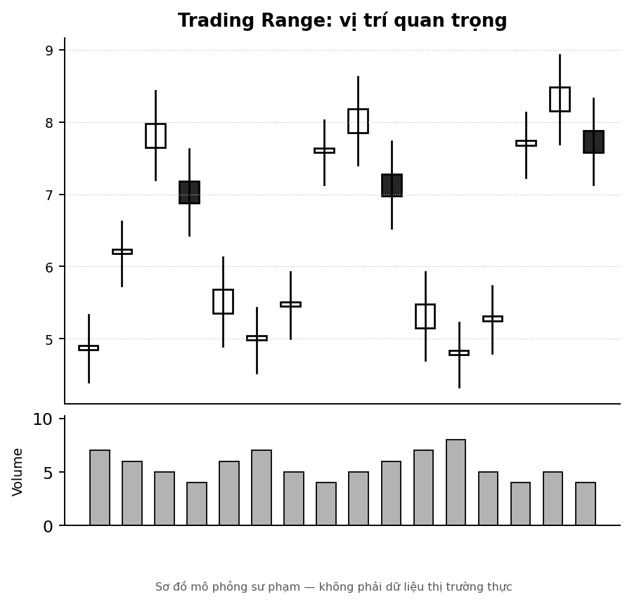

*Hình 7.1 — Trading Range và hai biên cấu trúc*
Chỉ ra ba khu vực: nơi ưu tiên quan sát mua, nơi ưu tiên quan sát bán/phòng thủ và khu vực nên kiên nhẫn.

## Lời giải và cách suy luận

Biên dưới và retest support có lợi thế để quan sát Demand; biên trên để quan sát Supply/breakout; giữa Range thường là vùng chờ.

## Tóm tắt chương

- Support/Resistance là vùng.
- Vị trí trong Range ảnh hưởng mạnh tới cách đọc và R:R.
- Acceptance/Rejection quan trọng hơn một lần xuyên mức.

# Chương 8 — Accumulation: SC, AR và ST

## Mục tiêu chương

Nhận diện quá trình Markdown bị chặn và dùng SC–AR–ST như chuỗi bằng chứng thay vì ba nhãn rời rạc.

Sau Markdown dài, một Selling Climax candidate chỉ là giả thuyết ban đầu. Automatic Rally cho thấy áp lực bán giảm/đối ứng tăng. Secondary Test kiểm tra lại vùng thấp để xem Supply còn bao nhiêu.

## 1. SC là candidate ở thời điểm xuất hiện

Volume lớn, Spread rộng và dừng giảm có thể là SC/Stopping action, nhưng không nên xác nhận chỉ từ một bar. AR và ST phía sau làm giả thuyết đáng tin hơn.

## 2. AR xác lập biên trên tạm thời

Sau áp lực bán cực lớn, rally mạnh tạo khung ban đầu cho Trading Range. Không cần cố xác định chính xác một tick làm biên.

## 3. ST kiểm tra Supply

Một ST tốt thường cho Result giảm kém hơn SC, Spread/Volume thấp hơn và không có acceptance sâu dưới đáy SC. ST là event/zone, không phải số bar cố định.

## Sai lầm thường gặp

- **Gọi mọi đáy Volume lớn là SC** Cần background Markdown và follow-through.
- **ST phải có đúng hình dạng** Chức năng là kiểm tra Supply, không phải hình học.
- **Mua ngay SC bằng toàn bộ vị thế** Đây mới là tín hiệu sớm, độ bất định cao.

## Checklist áp dụng

- Có Markdown trước đó không?
- SC candidate có dừng được Result giảm?
- AR có tạo rally rõ?
- ST có cho thấy Supply giảm so với SC?

## Bài tập

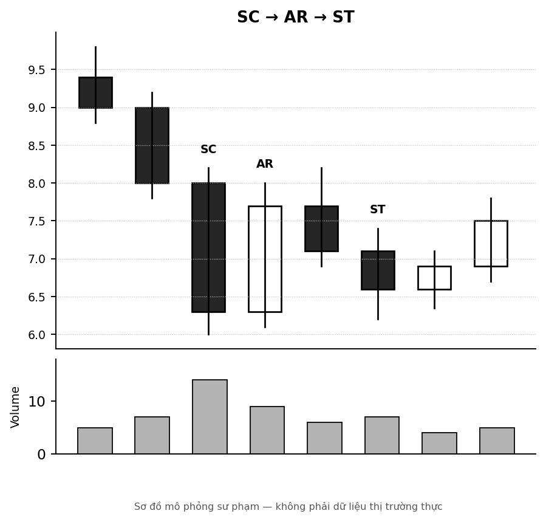

*Hình 8.1 — SC → AR → ST*
Hãy mô tả vì sao bar ST có thể đáng tin hơn nếu Volume/Spread giảm và đáy SC không bị chấp nhận phía dưới.

## Lời giải và cách suy luận

Điểm cốt lõi là Result giảm của ST nhỏ hơn trong khi Effort giảm; điều đó phù hợp với Supply yếu đi. Nhưng cần tiếp tục theo dõi Demand.

## Tóm tắt chương

- SC nên được coi là candidate cho tới khi cấu trúc sau đó ủng hộ.
- AR và ST biến một bar dừng giảm thành câu chuyện cấu trúc.
- ST tốt phản ánh Supply còn ít hơn tại vùng thấp.

# Chương 9 — Spring, Shakeout và Test

## Mục tiêu chương

Phân biệt xuyên hỗ trợ rồi bị từ chối với Breakdown thật; hiểu Test sau Spring là bước giảm bất định.

Spring thường xuất hiện gần cuối một Trading Range tích lũy nhưng không phải mọi Accumulation đều bắt buộc có Spring. Điều cốt lõi là mức giá thấp bị từ chối và thị trường quay lại Range.

## 1. Spring candidate

Khi giá xuyên support rồi quay lại, ta mới có candidate. Volume có thể cao hoặc thấp; quan trọng là Result và follow-through. Nếu giá được chấp nhận dưới support, giả thuyết Spring bị phủ định.

## 2. Test

Sau Spring, Test có Spread/Volume thấp hơn và không tạo Result giảm đáng kể cho thấy Supply ở vùng thấp đã ít. Demand bar sau Test làm bằng chứng mạnh hơn.

## 3. Điểm vào theo mức độ xác nhận

Mua Spring cho giá tốt nhưng bất định cao. Mua sau Test/Demand confirmation cân bằng hơn. Mua sau SOS xác nhận mạnh hơn nhưng giá thường cao hơn.

## Sai lầm thường gặp

- **Thủng support = Spring** Có thể là Breakdown thật.
- **Spring phải Volume thấp** Có Spring/Shakeout Volume cao; Result quan trọng hơn.
- **Không có Spring thì không phải Accumulation** Phase C có thể là final test mà không có Spring kinh điển.

## Checklist áp dụng

- Có Trading Range tích lũy?
- Phá dưới bị rejection hay acceptance?
- Test có Effort/Result thấp hơn?
- Demand có quay lại?
- Điểm vô hiệu nằm ở đâu?

## Bài tập

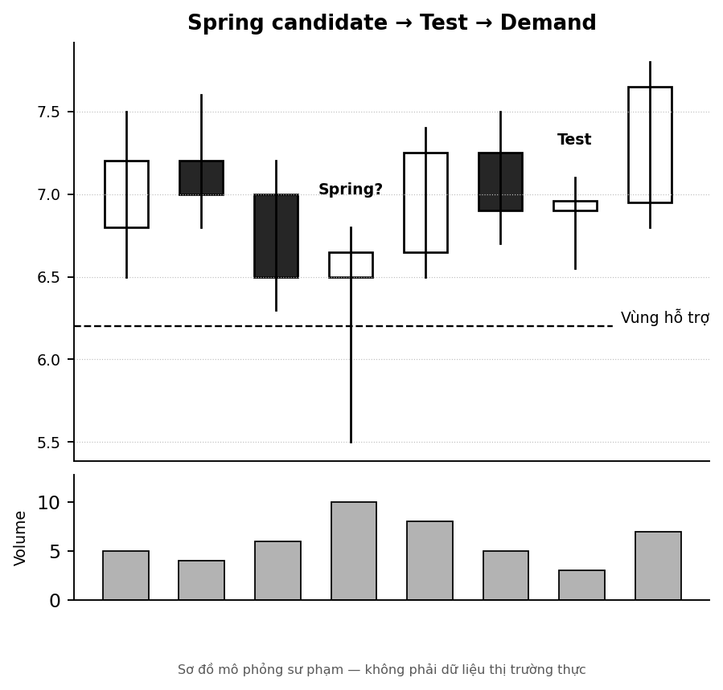

*Hình 9.1 — Spring candidate → Test → Demand*
Nếu chỉ được chọn một điểm mua giữa Spring, Test và Demand bar sau Test, hãy giải thích theo R:R và độ xác nhận.

## Lời giải và cách suy luận

Không có đáp án tuyệt đối. Spring là entry sớm; Test/Demand confirmation thường cân bằng hơn; điểm sau xác nhận mạnh có thể R:R kém hơn. Phải nêu điều kiện vô hiệu.

## Tóm tắt chương

- Spring = rejection dưới support, không chỉ là xuyên support.
- Test giúp đánh giá Supply còn lại.
- Bằng chứng mạnh hơn thường đi kèm giá kém hơn.

# Chương 10 — SOS và LPS

## Mục tiêu chương

Nhận ra thời điểm Demand chuyển từ giả thuyết sang Strength có Result và tìm điểm mua pullback có R:R tốt hơn.

SOS là Sign of Strength: Demand tạo Result cấu trúc, thường là vượt resistance/di chuyển mạnh khỏi nền. LPS là pullback yếu sau Strength, nơi Supply phản công nhưng không tạo được Result đáng kể.

## 1. SOS không chỉ là nến xanh lớn

Cần background Accumulation/Re-accumulation, vị trí gần biên trên, breakout/Strength và acceptance. Một nến lớn ở cuối Markup có thể mang ý nghĩa hoàn toàn khác.

## 2. LPS cần SOS trước

LPS thường có pullback Spread hẹp, Volume giảm, giữ support mới và Demand quay lại. Không có Strength trước đó thì một nhịp giảm nhẹ chưa nên gọi là LPS.

## 3. Entry LPS

So với mua đúng SOS, LPS thường cho invalidation gần hơn và R:R tốt hơn, nhưng có rủi ro giá không retest mà tiếp tục chạy. Có thể chia vị thế nếu kế hoạch cho phép.

## Sai lầm thường gặp

- **Mọi breakout = SOS** Cần background và acceptance.
- **Mọi pullback Volume thấp = LPS** Phải có Strength trước đó.
- **Mua đuổi SOS đã xa nền** Xác nhận mạnh nhưng R:R có thể kém.

## Checklist áp dụng

- SOS tạo Result cấu trúc?
- Giá giữ được phía trên resistance?
- Pullback về vùng mới có Supply yếu?
- Demand quay lại sau LPS?

## Bài tập

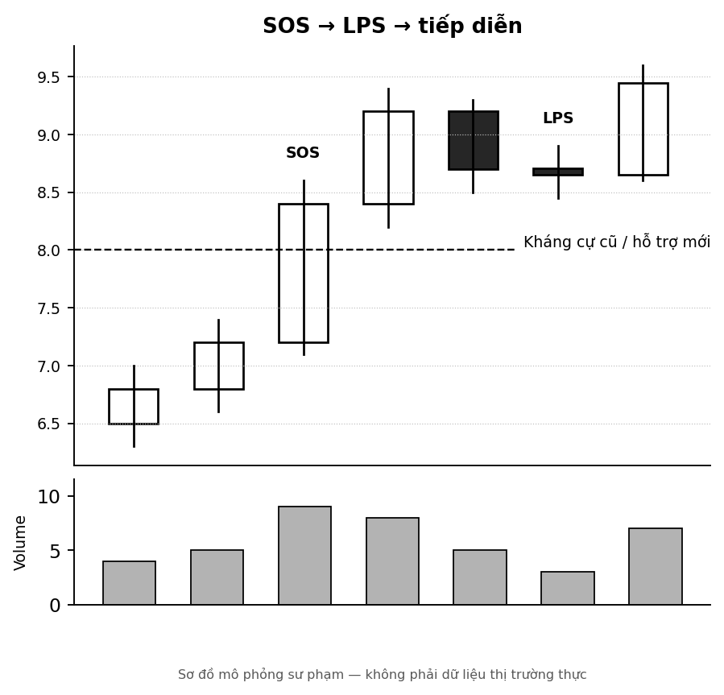

*Hình 10.1 — SOS → LPS → tiếp diễn*
So sánh entry tại SOS và tại LPS về bằng chứng, giá và khoảng cách tới invalidation.

## Lời giải và cách suy luận

SOS có xác nhận mạnh hơn ngay lúc xuất hiện; LPS thường có giá/điểm vô hiệu đẹp hơn nếu retest lành mạnh. Không nên biến LPS thành quy tắc bắt buộc nếu thị trường không retest.

## Tóm tắt chương

- SOS là Strength có Result và acceptance.
- LPS là Supply yếu sau Strength.
- Entry tốt cân bằng bằng chứng, vị trí và R:R.

# Chương 11 — Markup

## Mục tiêu chương

Học cách giữ cổ phiếu khỏe, phân biệt pullback lành mạnh với Weakness và tránh mua đuổi sau khi giá đã quá xa nền.

Phase E/Markup không có nghĩa giá chỉ tăng thẳng. Cấu trúc khỏe thường là rally hiệu quả và pullback yếu. Re-accumulation có thể xuất hiện giữa xu hướng.

## 1. Rally khỏe, pullback yếu

Trong Markup lành mạnh, các nhịp tăng tạo progress rõ; nhịp giảm co lại, Volume có thể giảm và support quan trọng được giữ. Demand bar quay lại sau pullback là dấu hiệu tiếp diễn.

## 2. Khoảng cách tới nền

Càng xa nền, một cây tăng mạnh càng cần đọc thận trọng vì R:R mua mới kém và nguy cơ climactic action cao hơn. Strength không đồng nghĩa entry hấp dẫn.

## 3. Re-accumulation

Sideway sau Markup chưa tự động là Distribution. Nếu pullback yếu dần, giá sống ở nửa trên và breakout được chấp nhận, có thể là Re-accumulation.

## Sai lầm thường gặp

- **Mua mọi nến xanh trong Markup** Bỏ qua vị trí và R:R.
- **Sideway sau tăng = Distribution** Có thể là Re-accumulation.
- **Pullback = xu hướng hỏng** Pullback yếu có thể là hành vi lành mạnh.

## Checklist áp dụng

- Rally có progress tốt?
- Pullback có Volume/Spread giảm?
- Support mới giữ?
- Giá đã xa nền đến mức nào?
- Có signs of climactic action không?

## Bài tập

Tự viết hai kịch bản cho một cổ phiếu đang Markup: pullback lành mạnh và chuyển sang Distribution.

## Lời giải và cách suy luận

Pullback lành mạnh phải có Supply yếu và Demand quay lại; chuyển Distribution phải có Demand mất hiệu quả, phản ứng giảm mạnh hơn hoặc thất bại tại vùng cao.

## Tóm tắt chương

- Markup khỏe = rally mạnh + pullback yếu.
- Không mua đuổi chỉ vì trend đang tăng.
- Sideway trong trend cần phân biệt Re-accumulation và Distribution.

# Chương 12 — Distribution: PSY, BC, AR và ST

## Mục tiêu chương

Nhận ra khi Markup bắt đầu bị chặn và xây Trading Range phân phối mà không vội bán chỉ từ một Buying Climax candidate.

Sau Markup dài, Preliminary Supply và Buying Climax candidate là dấu hiệu cảnh báo. Automatic Reaction và Secondary Test giúp biến cảnh báo thành cấu trúc phân phối tiềm năng.

## 1. BC candidate không phải lệnh bán tự động

Một bar tăng rất mạnh, Volume cực lớn, close tốt sau Markup dài có thể là climactic action nhưng cần phản ứng sau đó. Nếu giá vẫn tiếp tục tăng khỏe, nhãn BC có thể chưa đúng.

## 2. AR xác lập biên dưới

Reaction sâu sau vùng đỉnh tạo dấu hiệu Supply có khả năng tạo Result. Range hình thành giúp theo dõi các lần test Demand ở vùng cao.

## 3. ST vùng cao

Rally/Test quay lại vùng BC nhưng tạo Result kém hơn, hoặc Effort tăng mà progress không tương xứng, làm giả thuyết Distribution mạnh hơn.

## Sai lầm thường gặp

- **BC = bán hết ngay** Đó mới là cảnh báo, SOW/LPSY mạnh hơn cho quyết định thoát.
- **Volume cao ở đỉnh chắc chắn phân phối** Cần cấu trúc sau đó.
- **Bất kỳ sideway vùng cao = Distribution** Có thể là Re-accumulation.

## Checklist áp dụng

- Trước đó có Markup dài?
- BC candidate có làm xu hướng mất hiệu quả?
- AR có đủ mạnh?
- ST/rally vùng cao mạnh lên hay yếu đi?

## Bài tập

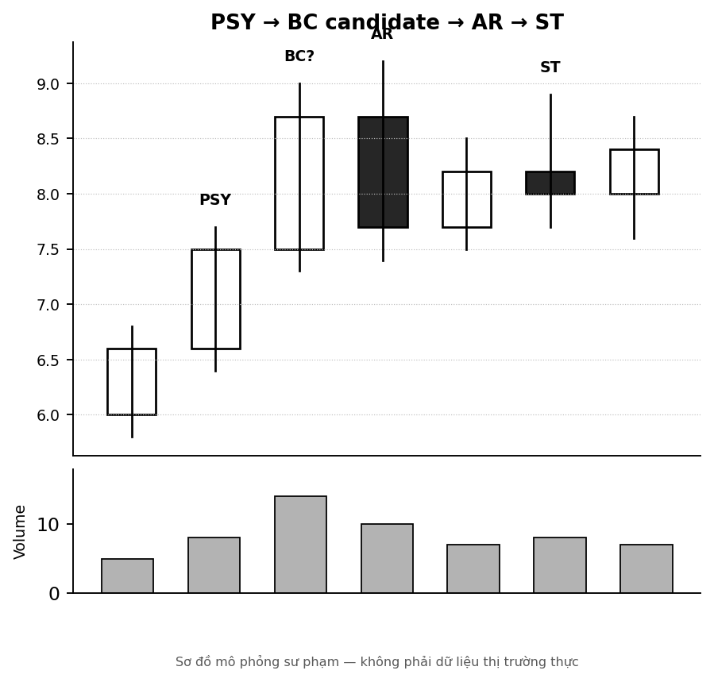

*Hình 12.1 — PSY → BC candidate → AR → ST*
Đánh dấu tại đâu ta chỉ nên cảnh giác và tại đâu cấu trúc Distribution bắt đầu đáng tin hơn.

## Lời giải và cách suy luận

BC candidate là cảnh báo; AR + ST và các rally mất hiệu quả mới làm giả thuyết Distribution có nền tảng cấu trúc hơn.

## Tóm tắt chương

- BC là candidate cho tới khi phản ứng sau đó xác nhận.
- Distribution là quá trình, không phải một cây Volume lớn.
- AR/ST giúp đọc thay đổi Demand/Supply ở vùng cao.

# Chương 13 — UT, UTAD và bài kiểm tra vùng cao

## Mục tiêu chương

Phân biệt cú vượt resistance bị từ chối với breakout thật và hiểu UT/UTAD là kiểm tra Demand trong bối cảnh phân phối.

Một cú vượt đỉnh chỉ trở thành Strength nếu giá được chấp nhận phía trên. Trong Distribution, cú vượt rồi quay lại Range có thể là Upthrust/UTAD candidate.

## 1. Rejection phía trên

Dấu hiệu chính là giá vượt resistance nhưng không giữ được, quay lại Range và follow-through yếu. Volume có thể cao hoặc thấp; Result cuối cùng quan trọng hơn mức Volume riêng lẻ.

## 2. UT và UTAD

UT có thể xuất hiện trong Range; UTAD thường là cú upthrust muộn sau quá trình Distribution. Không phải Distribution nào cũng có UTAD rõ.

## 3. Hành động

Nếu đang giữ hàng, UT/UTAD là cảnh báo tăng phòng thủ. SOW sau đó là bằng chứng mạnh hơn; LPSY có thể là xác nhận để thoát phần còn lại.

## Sai lầm thường gặp

- **Vượt đỉnh = breakout** Không xem acceptance.
- **UTAD phải Volume rất lớn** Không có yêu cầu cứng.
- **UT là bán khống/thoát ngay luôn** Trong khóa học, SOW/LPSY được xem là bằng chứng mạnh hơn.

## Checklist áp dụng

- Có Distribution background?
- Vượt resistance có giữ được?
- Giá quay lại Range nhanh không?
- Weakness sau đó có xuất hiện?

## Bài tập

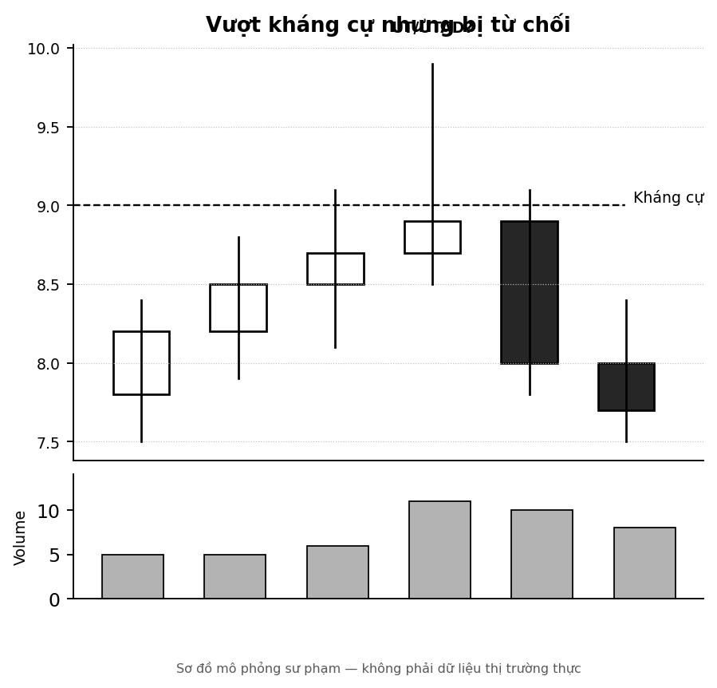

*Hình 13.1 — Vượt kháng cự nhưng bị từ chối*
Viết hai cách diễn giải cho bar vượt resistance: breakout thật và UT candidate; nêu bằng chứng tương lai cần thấy cho mỗi giả thuyết.

## Lời giải và cách suy luận

Breakout thật cần acceptance/follow-through; UT cần rejection, quay lại Range và Weakness. Không dùng bar vượt đỉnh một mình để quyết định.

## Tóm tắt chương

- UT/UTAD = rejection phía trên trong background phù hợp.
- Acceptance phân biệt breakout thật với bẫy.
- SOW/LPSY là các bước xác nhận Weakness mạnh hơn.

# Chương 14 — SOW, LPSY và Markdown

## Mục tiêu chương

Nhận diện khi Supply đã thắng cấu trúc và khi Demand phản công nhưng thất bại, từ đó quản trị thoát lệnh.

SOW (Sign of Weakness) là Result giảm có ý nghĩa cấu trúc. LPSY là rally yếu sau Weakness, thường retest support cũ trở thành resistance.

## 1. SOW

Break support với Spread/Volume phù hợp, close yếu và acceptance phía dưới cho thấy Supply đang tạo Result. Đây là bằng chứng mạnh hơn các cảnh báo sớm tại đỉnh.

## 2. LPSY

Sau SOW, rally Volume thấp/Spread hẹp và không lấy lại được vùng mất cho thấy Demand phản công yếu. LPSY là Demand yếu sau khi Supply đã thắng.

## 3. Markdown

Trong Markdown, các nhịp giảm khỏe và rally yếu. Không mua chỉ vì RSI/giá đã ‘rẻ’ hoặc giảm nhiều; cần stopping structure mới.

## Sai lầm thường gặp

- **Rally yếu = LPSY** Phải có Weakness/SOW trước.
- **SOW = bán tại đáy** Đây là phản ứng với cấu trúc bị phá, không phải dự đoán đỉnh.
- **Bắt đáy trong Markdown** Thiếu stopping action và bối cảnh Accumulation.

## Checklist áp dụng

- Support bị phá có acceptance?
- Rally sau SOW lấy lại được vùng cũ không?
- Volume/Spread của rally phản ánh Demand mạnh hay yếu?
- Markdown còn tạo lower low/lower high?

## Bài tập

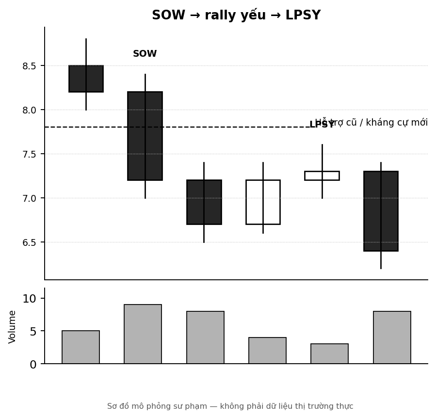

*Hình 14.1 — SOW → LPSY → Markdown*
Nếu đang nắm giữ từ Accumulation, hãy lập kế hoạch giảm vị thế tại SOW và xử lý phần còn lại tại LPSY.

## Lời giải và cách suy luận

Một kế hoạch điển hình của khóa học: SOW → giảm mạnh; rally yếu/LPSY → thoát phần còn lại nếu luận điểm Markup đã bị phủ định.

## Tóm tắt chương

- SOW là Weakness có Result cấu trúc.
- LPSY = Demand yếu sau SOW.
- Trong Markdown ưu tiên phòng thủ cho tới khi có stopping structure mới.

# PHẦN IV — ĐỌC WYCKOFF THEO PHASE

# Chương 15 — Accumulation Phase A → E

## Mục tiêu chương

Ghép các sự kiện riêng lẻ thành tiến trình chức năng: dừng Markdown, xây cause, kiểm tra Supply, Demand giành quyền kiểm soát và Markup.

Các Phase không phải khuôn hình bắt buộc. Chúng là cách tổ chức chức năng thị trường. Có Accumulation không có Spring kinh điển nhưng vẫn có final test hợp lý.

## Phase A — dừng Markdown

PS/SC/AR/ST cho thấy xu hướng giảm mất hiệu quả và Range bắt đầu hình thành.

## Phase B — xây cause và hấp thụ

Giá dao động trong Range; nhiệm vụ là theo dõi chất lượng rally/reaction và xem Supply có dần mất hiệu quả không.

## Phase C — final test

Có thể là Spring/Shakeout/Test hoặc một final test khác. Mục tiêu là kiểm tra Supply ở vùng thấp.

## Phase D — Demand kiểm soát

SOS/LPS và các chuỗi Strength cho thấy Demand tạo Result, Supply phản công yếu.

## Phase E — Markup

Giá rời Range; cấu trúc khỏe là rally mạnh và pullback yếu.

## Sai lầm thường gặp

- **Mọi Phase phải có đủ nhãn** Thị trường thực không luôn tạo textbook schematic.
- **Spring bắt buộc** Không; final test có thể mang hình dạng khác.
- **Phase B là vùng vô nghĩa** Đây là nơi quan sát absorption và thay đổi chất lượng cung/cầu.

## Checklist áp dụng

- Phase A đã dừng Markdown?
- Trong B, Supply/Demand bên nào mất hiệu quả?
- C có final test hợp lý?
- D có SOS/LPS?
- E có acceptance ngoài Range?

## Bài tập

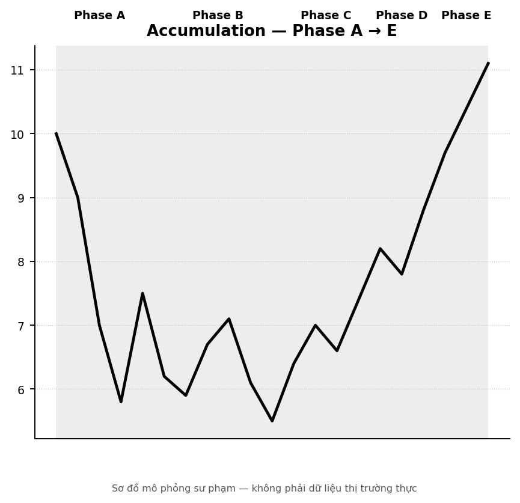

*Hình 15.1 — Accumulation Phase A đến E*
Tự mô tả chức năng của từng Phase mà không cần gắn mọi bar vào một tên sự kiện.

## Lời giải và cách suy luận

Đáp án tốt nói về chức năng: dừng xu hướng, xây cause, test Supply, Demand giành kiểm soát, Markup; không cần ép đủ sự kiện mẫu.

## Tóm tắt chương

- Phase là chức năng, không phải hình cứng.
- Phase C không bắt buộc Spring.
- Phase D/E cần Strength có Result và acceptance.

# Chương 16 — Distribution Phase A → E

## Mục tiêu chương

Tổ chức các sự kiện phân phối thành tiến trình: dừng Markup, chuyển hàng, kiểm tra Demand, Supply giành quyền kiểm soát và Markdown.

Distribution là quá trình Demand dần mất hiệu quả và Supply ngày càng tạo được Result. Không phải mọi Distribution đều có UTAD rõ.

## Phase A — dừng Markup

PSY/BC candidate/AR/ST tạo Range và cho thấy xu hướng tăng không còn trơn tru.

## Phase B — phân phối

Theo dõi rally kém dần, reaction mạnh hơn, giá dành nhiều thời gian ở nửa dưới Range.

## Phase C — final demand test

Có thể UT/UTAD hoặc một test vùng cao khác; chức năng là kiểm tra liệu Demand còn đủ để hấp thụ Supply hay không.

## Phase D — Supply thắng

SOW/LPSY cho thấy Weakness và Demand phản công yếu.

## Phase E — Markdown

Giá rời Range xuống dưới; rally thường yếu và bị bán.

## Sai lầm thường gặp

- **UTAD bắt buộc** Không; final test có thể khác.
- **BC = Phase C** BC thường ở Phase A, UTAD thường muộn hơn.
- **Một reaction = Markdown** Cần cấu trúc và acceptance.

## Checklist áp dụng

- Markup có bị chặn?
- Trong B, rally hay reaction đang mạnh lên?
- C có rejection vùng cao?
- D có SOW/LPSY?
- E có acceptance dưới Range?

## Bài tập

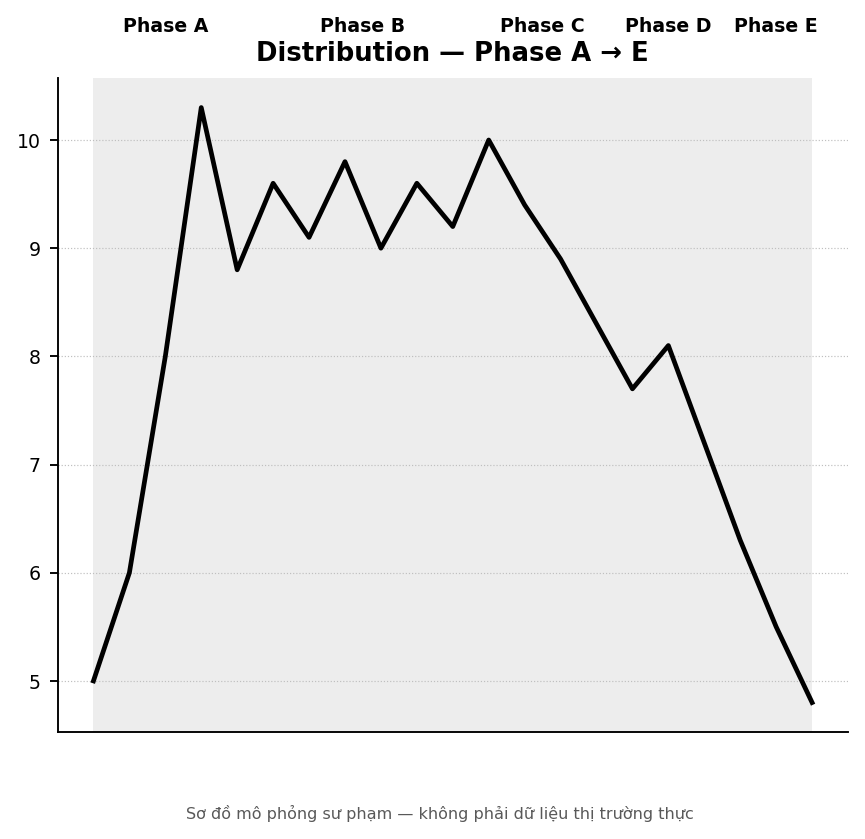

*Hình 16.1 — Distribution Phase A đến E*
So sánh Phase B của Accumulation và Distribution: chỉ ra vì sao hình sideway không đủ để phân biệt.

## Lời giải và cách suy luận

Phải đọc chất lượng rally/reaction, vị trí giá trong Range và bên nào mất hiệu quả. Hình dạng đi ngang đơn thuần không quyết định nhãn.

## Tóm tắt chương

- Distribution là quá trình, không phải một đỉnh.
- Demand mất hiệu quả là chìa khóa.
- SOW/LPSY mạnh hơn cảnh báo sớm tại BC/UT.

# Chương 17 — Một chu kỳ hoàn chỉnh

## Mục tiêu chương

Đọc biểu đồ từ trái sang phải mà không dùng hindsight: Markdown → Accumulation → Markup → Distribution → Markdown.

Khả năng đọc chu kỳ hoàn chỉnh là mục tiêu trung gian của khóa học. Người học phải phân biệt điều gì biết được tại thời điểm đó và điều gì chỉ trở nên rõ sau follow-through.

## 1. Từ Markdown sang Accumulation

Chờ stopping action, AR/ST và các bằng chứng Supply yếu dần thay vì bắt đáy vì giá đã giảm nhiều.

## 2. Từ Accumulation sang Markup

Final test → SOS → LPS tạo chuỗi bằng chứng tăng dần. Điểm mua không nhất thiết nằm ở bar Strength mạnh nhất.

## 3. Từ Markup sang Distribution

Cảnh báo climactic action, Demand mất hiệu quả, Range vùng cao; tránh bán chỉ vì một bar.

## 4. Từ Distribution sang Markdown

SOW và LPSY chuyển cảnh báo thành bằng chứng Supply kiểm soát.

## Sai lầm thường gặp

- **Dùng dữ liệu bên phải để gọi tên bên trái** Trong thực chiến phải dùng candidate language cho tới khi xác nhận.
- **Tìm một điểm mua duy nhất ‘đúng’** Có nhiều entry tùy mức độ xác nhận/R:R.
- **Tìm đỉnh chính xác** Quản trị vị thế theo bằng chứng thường thực tế hơn.

## Checklist áp dụng

- Tại mỗi mốc, dữ kiện lúc đó cho phép kết luận tới đâu?
- Giả thuyết thay đổi khi có bar mới không?
- Entry/exit dựa trên bằng chứng nào?

## Bài tập

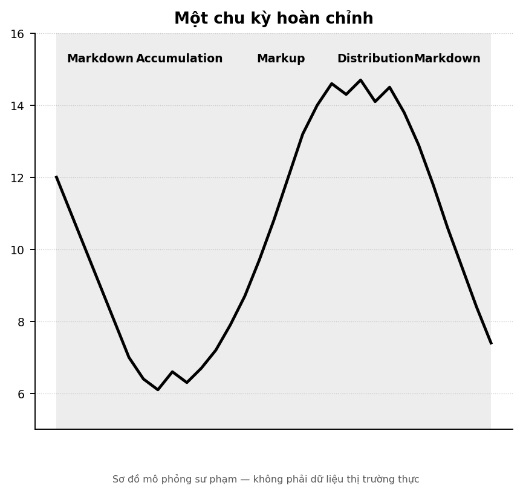

*Hình 17.1 — Chu kỳ Markdown → Accumulation → Markup → Distribution → Markdown*
Đọc từ trái sang phải, dừng ở mỗi ranh giới pha và viết: điều biết được, điều chưa biết, hành động hợp lý.

## Lời giải và cách suy luận

Điểm cao nhất của bài là không dùng hindsight. SC/BC/Spring/UT nên là candidate ở thời điểm xuất hiện; confirmation mới cho phép nâng độ tin cậy.

## Tóm tắt chương

- Chu kỳ là câu chuyện thay đổi quyền kiểm soát Supply/Demand.
- Đọc trái sang phải tránh ảo giác hindsight.
- Candidate → confirmation là ngôn ngữ nên dùng trong thực chiến.

# PHẦN V — VSA TRONG BỐI CẢNH WYCKOFF

# Chương 18 — No Supply và thiếu Demand

## Mục tiêu chương

Phân biệt hai trạng thái dễ nhầm vì cả hai có thể có Spread hẹp và Volume thấp.

No Supply là bằng chứng Selling pressure thấp trong background Strength/đúng vị trí. Thiếu Demand là Demand không đủ trong background Weakness. Bề mặt có thể giống nhau, nhưng bên đang được kiểm tra khác nhau.

## 1. No Supply

Sau Strength/SOS, một pullback giảm nhẹ, Spread hẹp, Volume thấp và giữ support cho thấy Supply chủ động yếu. Demand confirmation sau đó làm tín hiệu hữu ích hơn.

## 2. Thiếu Demand

Sau Weakness/SOW hoặc dưới resistance, rally hẹp Volume thấp cho thấy Demand không đủ sức lấy lại cấu trúc.

## 3. Quy tắc ‘ai vừa thắng?’

Sau SOS, pullback yếu → Supply yếu → nghi LPS/No Supply. Sau SOW, rally yếu → Demand yếu → nghi LPSY/No Demand.

## Sai lầm thường gặp

- **Volume thấp = No Supply** Phải xem hướng và background.
- **No Supply = Demand mạnh** No Supply chỉ nói Selling pressure thấp; cần Demand quay lại.
- **Rally Volume thấp trong Markup = xấu** Nếu Supply cạn và giá vẫn giữ cấu trúc, có thể chỉ là Demand tạm nghỉ.

## Checklist áp dụng

- Bar đi xuống hay đi lên?
- Background Strength hay Weakness?
- Nằm ở support hay resistance?
- Bên còn lại có xác nhận không?

## Bài tập

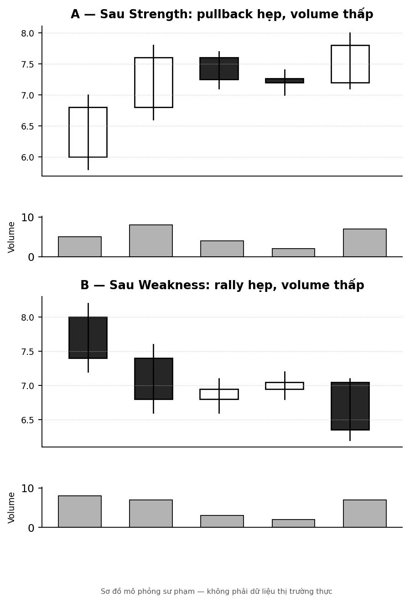

*Hình 18.1 — No Supply và thiếu Demand trong hai background khác nhau*
Không nhìn tiêu đề, hãy mô tả: bên nào đang được kiểm tra ở panel trên và panel dưới?

## Lời giải và cách suy luận

Panel trên: sau Strength, nhịp giảm Effort thấp → Supply yếu. Panel dưới: sau Weakness, rally Effort thấp → Demand yếu. Hình dạng Volume thấp không đủ nếu thiếu background.

## Tóm tắt chương

- No Supply và thiếu Demand có thể giống hình.
- Background quyết định bên nào đang yếu.
- No Supply cho phép quan tâm; Demand confirmation mới cho phép hành động mạnh hơn.

# Chương 19 — Stopping Action và Climactic Action

## Mục tiêu chương

Hệ thống hóa những nội dung nguồn hiện có về Selling Climax, Stopping Volume và Buying Climax mà không biến một Volume spike thành kết luận chắc chắn.

Nguồn khóa học đã bàn về SC, Stopping Volume và BC trong nhiều ngữ cảnh. Điểm chung là Effort rất lớn sau một xu hướng kéo dài nhưng Result sau đó phải được quan sát để xác định xu hướng có thực sự bị chặn hay không.

## 1. Sau Markdown

Volume lớn + giá giảm mạnh nhưng sau đó không giảm tiếp có thể là SC/Stopping Volume/cầu hấp thụ cung. Cần AR → ST hoặc cấu trúc tương đương để tăng độ tin cậy.

## 2. Sau Markup

Volume cực lớn + giá tăng mạnh nhưng sau đó không tiến xa có thể là BC/cung hấp thụ cầu. BC candidate là cảnh báo, không phải lệnh bán tự động.

## 3. Climactic không đồng nghĩa đảo chiều ngay

Một bar cực đoan có thể chỉ là exhaustion tạm thời. Chỉ khi reaction, Range và Weakness/Strength sau đó phát triển thì nhãn cấu trúc mới rõ hơn.

## Sai lầm thường gặp

- **Volume spike = climax** Cần vị trí xu hướng và Result.
- **Climax = đảo chiều ngay** Có thể tiếp tục một đoạn hoặc chuyển Range.
- **SC/BC là tên chắc chắn tại bar** Nên dùng candidate cho tới khi có cấu trúc sau.

## Checklist áp dụng

- Xu hướng trước đó đã kéo dài?
- Effort có cực đoan?
- Result tiếp tục hay bị chặn?
- AR/ST hoặc reaction/test có xuất hiện?

## Bài tập

So sánh hai Volume spike: một sau Markdown dài và một sau Markup dài. Không gắn nhãn trước khi xem 3–5 bar tiếp theo.

## Lời giải và cách suy luận

Một spike sau Markdown có thể là stopping action nếu Result giảm dừng; một spike sau Markup có thể là buying climax nếu Result tăng dừng. Cả hai cần follow-through.

## Tóm tắt chương

- Climactic action cần context xu hướng.
- Stopping được xác nhận bởi việc xu hướng cũ mất Result.
- Candidate language giúp tránh hindsight.

# Chương 20 — Absorption

## Mục tiêu chương

Hiểu absorption như quá trình một bên liên tục bỏ Effort nhưng tạo Result ngày càng nhỏ, và phân biệt hấp thụ Supply với hấp thụ Demand.

Absorption không tự mang nghĩa tăng hay giảm. Câu hỏi trọng tâm là: **bên nào đang bỏ nhiều Effort nhưng ngày càng khó tạo Result?**

## 1. Absorption of Supply

Supply tiếp tục xuất hiện nhưng reaction giảm ngày càng nông; giá bám vùng cao; cuối cùng Demand có thể breakout/SOS. Supply đang mất hiệu quả.

## 2. Absorption of Demand

Demand liên tục cố đẩy giá lên từ support nhưng rally ngày càng yếu; giá bám vùng thấp; cuối cùng Supply có thể SOW/Breakdown. Demand đang mất hiệu quả.

## 3. Absorption là quá trình

Một bar Volume lớn + Spread hẹp chỉ chứng minh đấu tranh/lực đối ứng. Muốn gọi absorption cần chuỗi nhiều lần thử và Result thay đổi theo thời gian.

## 4. Follow-through là trọng tài

Hấp thụ Supply cần Strength/breakout xác nhận; hấp thụ Demand cần Weakness/breakdown. Nếu cấu trúc không phát triển như vậy, giả thuyết phải được hạ độ tin cậy.

## Sai lầm thường gặp

- **Volume lớn Spread hẹp = absorption** Đó mới là tranh chấp; chưa biết bên nào bị hấp thụ.
- **Dính resistance = Distribution** Nếu reaction nông dần có thể chính Supply đang bị hấp thụ.
- **Dính support = Accumulation** Nếu rally yếu dần có thể Demand đang bị hấp thụ.

## Checklist áp dụng

- Bên nào đang thử nhiều lần?
- Mỗi lần thử Result lớn hơn hay nhỏ hơn?
- Giá sống ở nửa trên hay nửa dưới?
- Breakout/breakdown cuối cùng xác nhận gì?

## Bài tập

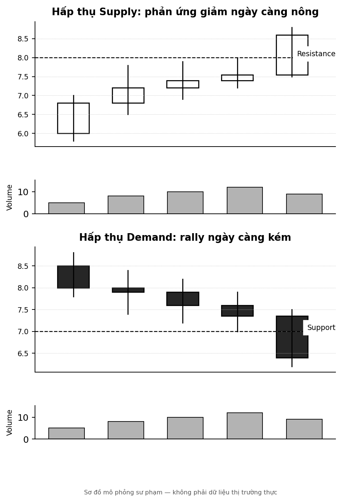

*Hình 20.1 — Absorption of Supply và Absorption of Demand*
Mô tả bên nào mất hiệu quả trong từng panel và tín hiệu xác nhận cuối cùng cần xuất hiện.

## Lời giải và cách suy luận

Panel trên: Supply mất hiệu quả → chờ SOS/breakout. Panel dưới: Demand mất hiệu quả → chờ SOW/breakdown. Không kết luận từ Volume một bar.

## Tóm tắt chương

- Absorption là quá trình, không phải bar.
- Hấp thụ Supply thường thấy reaction nông dần gần resistance.
- Hấp thụ Demand thường thấy rally yếu dần gần support.
- Follow-through xác nhận bên thắng.

# Chương 21 — Professional Buying / Professional Selling

## Mục tiêu chương

Ghi rõ giới hạn nguồn để tránh tự bổ sung một kỹ thuật chưa được giảng đầy đủ trong khóa học.

Trong lộ trình gốc, **Professional Buying** và **Professional Selling** được liệt kê là chủ đề VSA cần học. Tuy nhiên phần nguồn hiện truy cập được chưa chứa một bài giảng độc lập đủ chi tiết để xác lập tiêu chí, biến thể, ví dụ và bài tập cho hai khái niệm này.

## 1. Những gì nguồn hiện có hỗ trợ

Nguồn cho phép nói về Demand/Supply hiệu quả, Stopping Volume, Climactic action, Absorption, SOS/SOW và cách đọc Price + Volume. Những khái niệm này có liên quan về mặt quan sát hành vi dòng tiền lớn.

## 2. Những gì không nên tự viết thêm

Không nên tự đặt một checklist ‘Professional Buying’ hoặc ‘Professional Selling’ riêng khi khóa học chưa xác định rõ tiêu chí. Làm như vậy sẽ biến sách thành giáo trình mới thay vì biên tập khóa học.

## 3. Cách sử dụng chương này

Xem đây là cột mốc cần bổ sung khi nguồn học tiếp tục. Các bản cập nhật sau có thể thay chương bằng bài giảng hoàn chỉnh mà không ảnh hưởng cấu trúc còn lại.

## Sai lầm thường gặp

- **Tự suy diễn từ tên thuật ngữ** Vi phạm nguyên tắc bám nguồn.
- **Dùng nội dung internet để lấp chỗ trống mà không nói rõ** Làm mất tính kế thừa của khóa học.

## Checklist áp dụng

- Nguồn có định nghĩa rõ chưa?
- Có ví dụ/bài tập chưa?
- Nếu chưa, đánh dấu thiếu nguồn thay vì sáng tác.

## Bài tập

Không có bài tập kỹ thuật ở phiên bản này. Hãy ghi lại những câu hỏi cần trả lời khi bài học được bổ sung: bối cảnh, Price/Volume, xác nhận, phủ định và hành động.

## Lời giải và cách suy luận

Chương này cố ý không đưa đáp án kỹ thuật vượt ngoài nguồn hiện có.

## Tóm tắt chương

- Đây là chương trạng thái nguồn.
- Không lấp khoảng trống bằng kiến thức ngoài khóa học nếu chưa được yêu cầu.
- Có thể cập nhật ở phiên bản sau.

# PHẦN VI — NHỮNG CẶP TÍN HIỆU DỄ NHẦM

# Chương 22 — Re-accumulation hay Distribution?

## Mục tiêu chương

Phân biệt hai Trading Range sau Markup bằng hiệu quả của Supply/Demand thay vì chỉ dựa vào vị trí vùng cao.

Cả Re-accumulation và Distribution đều có thể là một Range sau xu hướng tăng. Điểm phân biệt nằm ở việc bên nào ngày càng mất hiệu quả.

## 1. Re-accumulation

Pullback nông dần, Volume phản ứng giảm, support giữ, giá dành nhiều thời gian ở nửa trên, rally cải thiện và breakout được chấp nhận → Supply có dấu hiệu bị hấp thụ.

## 2. Distribution

Rally tạo Result kém dần, reaction mạnh hơn, support bị test nhiều, giá sống ở nửa dưới; cuối cùng SOW có thể xuất hiện → Demand mất hiệu quả.

## 3. Giữ giả thuyết trung tính sớm

Ở nửa đầu Range, bằng chứng thường chưa đủ. Không cần ép tên; có thể ghi ‘Trading Range sau Markup — chưa xác định’.

## Sai lầm thường gặp

- **Range sau tăng = Distribution** Bỏ qua Re-accumulation.
- **Breakout nhỏ = Re-accumulation** Cần acceptance và background.
- **Gắn nhãn quá sớm** Range giữa quá trình thường mơ hồ.

## Checklist áp dụng

- Pullback nông hay sâu dần?
- Rally hiệu quả hơn hay kém hơn?
- Giá ở nửa trên hay dưới?
- Breakout/breakdown được chấp nhận?

## Bài tập

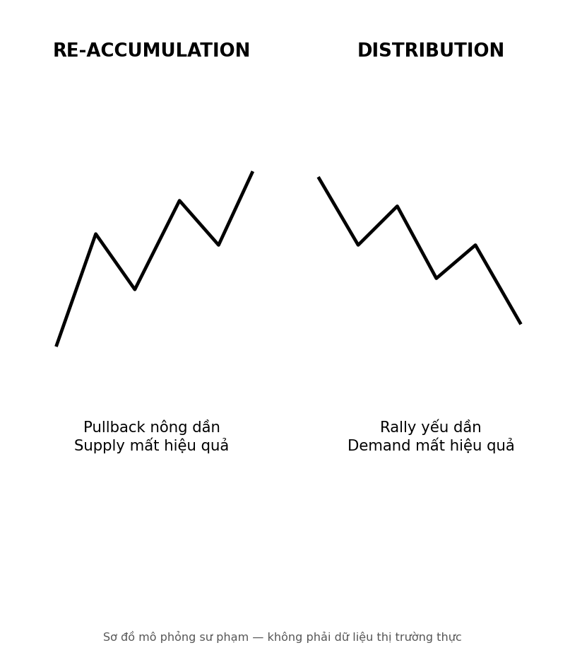

*Hình 22.1 — Re-accumulation và Distribution*
Che phần tiêu đề và mô tả bên nào mất hiệu quả ở mỗi nửa hình.

## Lời giải và cách suy luận

Bên trái: Supply mất hiệu quả → Re-accumulation candidate. Bên phải: Demand mất hiệu quả → Distribution candidate. Cần breakout/SOW để nâng độ tin cậy.

## Tóm tắt chương

- Hình sideway không đủ phân biệt.
- Ai mất hiệu quả mới là câu hỏi chính.
- Giữ trung tính khi bằng chứng còn cân bằng.

# Chương 23 — Spring hay Breakdown?

## Mục tiêu chương

Dùng Acceptance/Rejection để phân biệt cú phá support là bẫy thấp giá hay Weakness thật.

Hai tình huống đều bắt đầu bằng việc giá đi dưới support. Sự khác biệt nằm ở việc thị trường **từ chối** hay **chấp nhận** vùng giá thấp.

## Spring candidate

Phá dưới support, quay lại Range, Demand xuất hiện và Test giữ. Giá thấp bị từ chối.

## Breakdown thật

Phá support, tiếp tục nằm dưới, retest yếu và support cũ thành resistance. Giá thấp được chấp nhận.

## Hành động

Spring candidate cho phép chờ Demand confirmation; Breakdown yêu cầu phòng thủ/thoát nếu luận điểm long bị vô hiệu.

## Sai lầm thường gặp

- **Thủng nhẹ = stop out ngay** Support là vùng; cần xem acceptance.
- **Mọi rút chân = Spring** Cần Range/background và follow-through.
- **Chờ quá lâu sau Breakdown** Acceptance dưới vùng là bằng chứng luận điểm đã thay đổi.

## Checklist áp dụng

- Phá dưới bao lâu?
- Close quay lại vùng không?
- Bar sau nằm ở đâu?
- Retest support cũ mạnh hay yếu?

## Bài tập

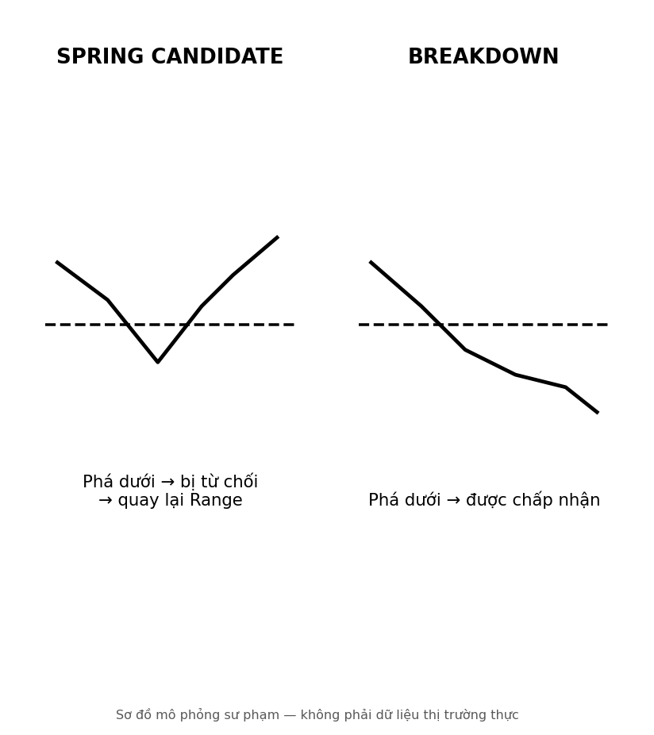

*Hình 23.1 — Rejection dưới support và Acceptance dưới support*
Viết một câu cho mỗi bên bắt đầu bằng ‘Thị trường đã…’. Không dùng tên Spring/Breakdown cho tới câu cuối.

## Lời giải và cách suy luận

Bên trái: thị trường đã thử giá thấp nhưng không chấp nhận → Spring candidate. Bên phải: thị trường đã phá và duy trì giá thấp → Breakdown.

## Tóm tắt chương

- Spring = rejection, Breakdown = acceptance.
- Support là vùng.
- Follow-through là bằng chứng quyết định.

# Chương 24 — Breakout hay UT/UTAD?

## Mục tiêu chương

Dùng Acceptance/Rejection phía trên resistance để phân biệt Strength thật với cú vượt đỉnh thất bại.

Đây là hình ảnh đối xứng với Chương 23. Cả hai bắt đầu bằng vượt resistance; khác nhau ở việc vùng giá cao có được chấp nhận hay không.

## Breakout thật

Vượt resistance, close/giữ phía trên, follow-through hoặc retest biến resistance thành support.

## UT/UTAD candidate

Vượt resistance nhưng quay lại Range, rally không tiếp diễn và Weakness xuất hiện sau đó.

## Giao dịch

Có thể mua breakout, mua retest hoặc chờ Demand confirmation. Retest thường cho R:R tốt hơn nhưng không phải lúc nào cũng xuất hiện.

## Sai lầm thường gặp

- **Breakout = mua ngay** Bỏ qua acceptance và khoảng cách invalidation.
- **Volume cao = breakout tốt** Volume cao mà Result kém có thể là absorption/bull trap.
- **UTAD bắt buộc sau Distribution** Không phải mọi Distribution có UTAD rõ.

## Checklist áp dụng

- Giá có giữ phía trên?
- Retest có Supply thấp?
- Resistance cũ có thành support?
- Nếu quay lại Range, Weakness có theo sau?

## Bài tập

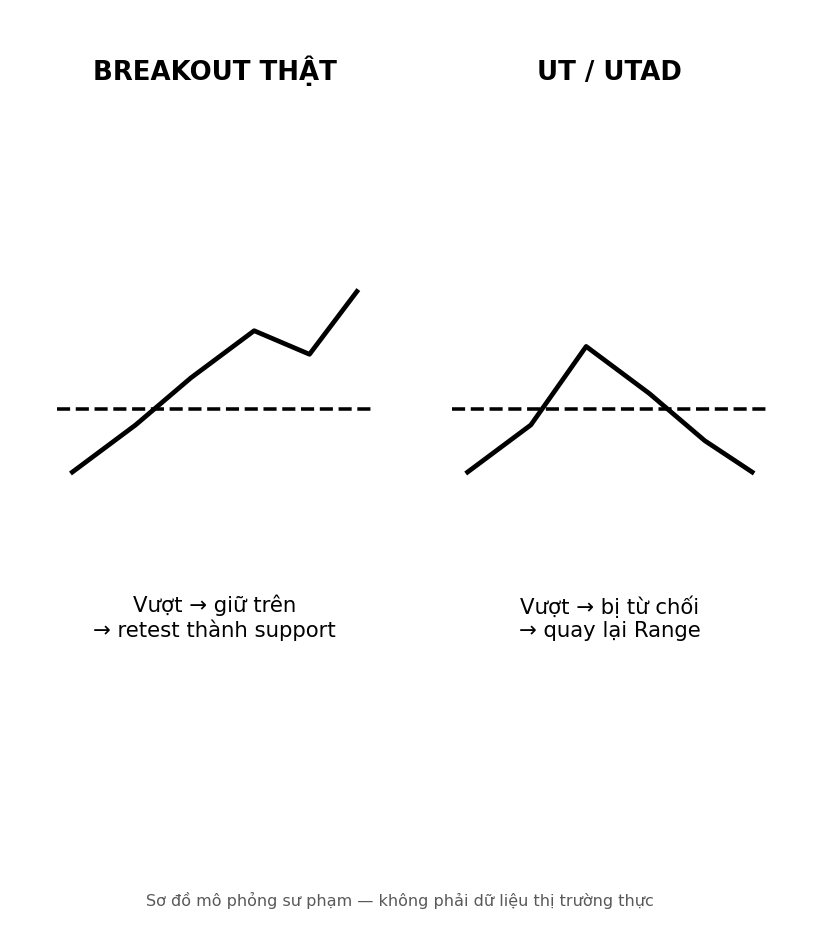

*Hình 24.1 — Acceptance phía trên và Rejection phía trên*
Hãy chọn điểm mà một trader thận trọng sẽ chờ trước khi xác nhận breakout.

## Lời giải và cách suy luận

Không phải cây vượt đỉnh mà là khả năng giữ vùng: close/follow-through/retest. Acceptance làm xác suất breakout thật cao hơn.

## Tóm tắt chương

- Breakout = acceptance phía trên.
- UT/UTAD = rejection phía trên trong background phù hợp.
- Retest thường cải thiện R:R.

# Chương 25 — SOS hay Buying Climax?

## Mục tiêu chương

Phân biệt hai cây tăng Spread rộng/Volume lớn bằng vị trí trong cấu trúc và khả năng duy trì Result.

SOS và BC candidate có thể nhìn rất giống nhau ở bar hiện tại. Câu hỏi đầu tiên phải là: **nó nằm ở đâu trong cấu trúc?**

## SOS

Thường sau Accumulation/Re-accumulation, gần nền, tạo breakout/Strength và được chấp nhận. Effort lớn tạo Result bền.

## Buying Climax candidate

Thường sau Markup dài, xa support; Effort cực lớn nhưng Result sau đó không bền, reaction sâu hoặc Range vùng cao phát triển.

## Quản trị

Nếu chưa có hàng, tránh mua đuổi bar nghi BC. Nếu đang có hàng, BC candidate là cảnh báo: ngừng gia tăng, có thể giảm một phần; SOW/LPSY là bằng chứng mạnh hơn để thoát.

## Sai lầm thường gặp

- **Close gần High = SOS** BC vẫn có thể close rất tốt.
- **BC = bán hết ngay** Cần reaction/SOW/LPSY.
- **Chỉ nhìn Volume** Location và persistence of Result quan trọng.

## Checklist áp dụng

- Nằm gần nền hay sau trend kéo dài?
- Effort lớn tạo Result bền không?
- Support gần nhất ở đâu?
- Reaction sau bar mạnh hay yếu?

## Bài tập

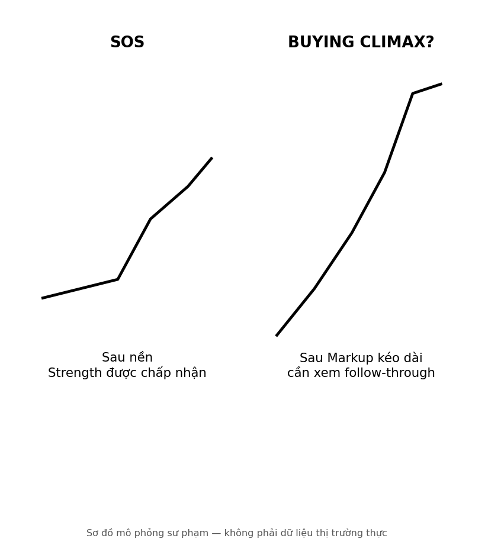

*Hình 25.1 — SOS gần nền và Buying Climax candidate sau Markup*
Không được dùng màu nến để trả lời. Hãy dùng location + follow-through.

## Lời giải và cách suy luận

SOS nằm sau nền và tạo acceptance; BC candidate nằm sau Markup kéo dài và cần theo dõi việc Result có mất bền vững không.

## Tóm tắt chương

- Location thay đổi ý nghĩa của cùng Price + Volume.
- SOS là Strength có persistence.
- BC candidate là cảnh báo, không phải phán quyết.

# Chương 26 — LPS hay LPSY?

## Mục tiêu chương

Dùng câu hỏi ‘ai vừa thắng?’ để phân biệt pullback Supply yếu với rally Demand yếu.

LPS và LPSY dễ nhầm nếu chỉ nhìn một cụm nhỏ. LPS xuất hiện **sau Strength**, LPSY xuất hiện **sau Weakness**.

## LPS

Sau SOS, giá pullback về hỗ trợ, Volume/Spread giảm, Supply yếu, Demand quay lại → có thể là điểm mua/gia tăng.

## LPSY

Sau SOW, giá rally lên resistance/support cũ, Volume/Spread thấp, Demand yếu, Supply quay lại → điểm phòng thủ/thoát, không phải mua.

## Câu hỏi rút gọn

SOS trước → pullback yếu = Supply yếu → LPS. SOW trước → rally yếu = Demand yếu → LPSY.

## Sai lầm thường gặp

- **Nhìn hướng nhỏ của bar** LPS là pullback xuống; LPSY là rally lên, nhưng background mới quyết định.
- **Gọi LPS khi chưa có SOS** Thiếu Strength nền.
- **Gọi LPSY khi chưa có SOW** Thiếu Weakness nền.

## Checklist áp dụng

- Ai vừa thắng trước đó — Demand hay Supply?
- Đây là pullback hay rally?
- Volume/Spread phản công có yếu?
- Vùng retest là support hay resistance?

## Bài tập

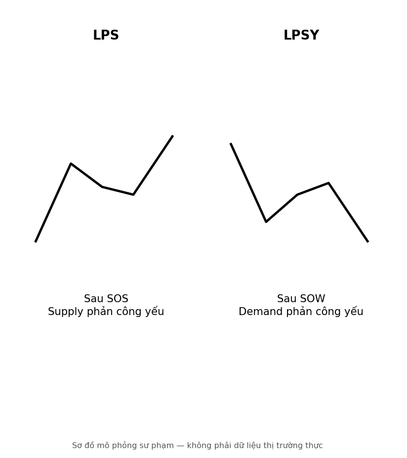

*Hình 26.1 — LPS và LPSY*
Viết một câu duy nhất cho mỗi panel bắt đầu bằng ‘Sau khi ___ thắng, bên ___ phản công yếu’.

## Lời giải và cách suy luận

LPS: sau Demand thắng, Supply phản công yếu. LPSY: sau Supply thắng, Demand phản công yếu.

## Tóm tắt chương

- LPS = Supply yếu sau Strength.
- LPSY = Demand yếu sau Weakness.
- Background là điều kiện bắt buộc.

# Chương 27 — Absorption of Supply hay Absorption of Demand?

## Mục tiêu chương

Nâng bài Absorption thành công cụ phân biệt bên nào bị tiêu hao qua nhiều lần test trong Range.

Cặp này không được giải bằng một cây Volume. Phải theo dõi **chuỗi lần thử** và Result tương ứng.

## Absorption of Supply

Supply xuất hiện ở resistance nhưng mỗi reaction giảm ngày càng nông; giá bám biên trên; cuối cùng SOS/breakout xác nhận.

## Absorption of Demand

Demand xuất hiện ở support nhưng mỗi rally ngày càng yếu; giá bám biên dưới; cuối cùng SOW/breakdown xác nhận.

## Vị trí giá trong Range

Dính biên trên là gợi ý Supply bị hấp thụ; dính biên dưới là gợi ý Demand bị hấp thụ. Đây là heuristic, không phải quy tắc tuyệt đối.

## Sai lầm thường gặp

- **Thấy Volume lớn ở resistance = Distribution** Có thể chính Supply đang bị hấp thụ.
- **Thấy Volume lớn ở support = Accumulation** Có thể Demand đang bị hấp thụ.
- **Không chờ kết quả cuối** Breakout/breakdown giúp xác nhận giả thuyết.

## Checklist áp dụng

- Bên nào bỏ Effort lặp lại?
- Result của bên đó co dần?
- Giá bám biên nào?
- Cấu trúc cuối cùng phá theo hướng nào?

## Bài tập

Tự vẽ hai chuỗi 4 lần test: một chuỗi reaction giảm nông dần ở resistance và một chuỗi rally yếu dần ở support.

## Lời giải và cách suy luận

Chuỗi một phù hợp hấp thụ Supply; chuỗi hai phù hợp hấp thụ Demand. Chỉ nâng độ tin cậy khi breakout/SOW xuất hiện.

## Tóm tắt chương

- Ai mất hiệu quả là câu hỏi chính.
- Absorption cần quá trình.
- Breakout/breakdown là confirmation quan trọng.

# PHẦN VII — TỪ PHÂN TÍCH ĐẾN GIAO DỊCH

# Chương 28 — Ba cấp độ điểm vào

## Mục tiêu chương

Hệ thống hóa entry sớm, entry xác nhận và entry cân bằng; chọn theo bằng chứng, vị trí và R:R thay vì tìm ‘điểm mua duy nhất’.

Trong các ví dụ khóa học, điểm Strength mạnh nhất không phải lúc nào là entry tốt nhất. Giá càng xác nhận nhiều, đôi khi càng xa invalidation.

## 1. Entry sớm

Spring/Test/Final test với Demand bắt đầu xác nhận. Giá đẹp và stop gần, nhưng xác suất cấu trúc chưa hoàn thiện cao hơn.

## 2. Entry xác nhận

SOS/breakout được chấp nhận. Bằng chứng mạnh hơn, nhưng có thể phải trả giá cao hơn và R:R giảm.

## 3. Entry cân bằng

Retest/LPS sau SOS. Supply yếu ở support mới và Demand quay lại; thường là lựa chọn ưa thích nếu thị trường cho cơ hội.

## 4. Chia vị thế

Có thể thăm dò nhỏ ở entry sớm, tăng khi SOS xác nhận, và gia tăng ở LPS nếu R:R còn tốt. Không bắt buộc; phải phù hợp kế hoạch rủi ro.

## Sai lầm thường gặp

- **Entry muộn luôn an toàn** Xác nhận cao hơn nhưng stop có thể xa/R:R xấu.
- **Entry sớm luôn tốt** Bằng chứng ít hơn.
- **Mua thêm vì giá giảm** Gia tăng phải theo bằng chứng Strength, không phải bình quân giá xuống.

## Checklist áp dụng

- Entry loại nào?
- Bằng chứng đã có bao nhiêu?
- Invalidation cách bao xa?
- R:R còn hợp lý?
- Có kế hoạch size cho từng lần vào?

## Bài tập

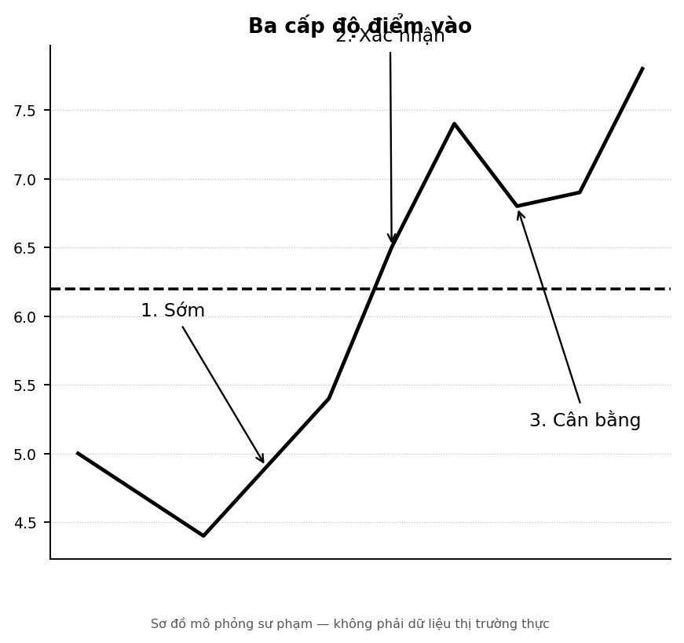

*Hình 28.1 — Entry sớm, xác nhận và cân bằng*
Nếu chỉ được chọn một entry, hãy nêu tiêu chí khiến bạn ưu tiên LPS/retest thay vì SOS hoặc Spring.

## Lời giải và cách suy luận

LPS/retest thường cân bằng evidence + location + invalidation. Tuy nhiên nếu không có retest, trader phải chấp nhận bỏ lỡ hoặc dùng kế hoạch khác; không đuổi theo vì FOMO.

## Tóm tắt chương

- Không có một entry duy nhất đúng cho mọi người.
- Bằng chứng tăng thường đổi lấy giá cao hơn.
- R:R và invalidation là phần của chất lượng entry.

# Chương 29 — Điểm vô hiệu

## Mục tiêu chương

Đặt stop/invalidation theo luận điểm cấu trúc thay vì một tỷ lệ phần trăm tùy ý hoặc một wick nhỏ.

Điểm vô hiệu trả lời: **điều gì xảy ra thì lý do tôi vào lệnh không còn đúng?** Đây khác với việc chọn một con số stop tùy tiện.

## 1. Invalidation cấu trúc

Nếu mua vì Spring + Test + support giữ, acceptance dưới vùng Spring/support là bằng chứng luận điểm sai. Nếu mua breakout, mất vùng breakout và quay sâu vào Range làm luận điểm suy yếu.

## 2. Vùng thay vì tick

Support/Resistance là vùng. Một xuyên nhẹ intraday chưa chắc vô hiệu; cần xem Close, Volume, Spread và acceptance.

## 3. Invalidation và position size

Khoảng cách tới invalidation càng xa thì size phải được điều chỉnh nếu muốn giữ rủi ro tiền tệ trong giới hạn. Nguồn hiện có nhấn mạnh bảo toàn vốn nhưng chưa triển khai công thức position sizing chi tiết.

## Sai lầm thường gặp

- **Stop ngay dưới một tick** Dễ bị noise trong vùng support.
- **Không cắt vì ‘cấu trúc dài hạn còn tốt’** Nếu luận điểm entry đã sai cần đánh giá lại.
- **Dời stop xa hơn sau khi giá đi ngược** Biến kế hoạch thành hy vọng.

## Checklist áp dụng

- Luận điểm vào lệnh là gì?
- Vùng nào nếu bị acceptance sẽ phủ định?
- Stop thực tế có quá xa để giữ size hợp lý?
- Có phân biệt wick với acceptance?

## Bài tập

Với entry LPS sau breakout, viết một điều kiện vô hiệu bằng ngôn ngữ cấu trúc, không dùng ‘-7%’.

## Lời giải và cách suy luận

Ví dụ đạt yêu cầu: giá phá và được chấp nhận trở lại dưới vùng breakout/LPS với Spread/Volume cho thấy Supply kiểm soát; khi đó luận điểm support mới đã thất bại.

## Tóm tắt chương

- Invalidation gắn với luận điểm.
- Support/Resistance là vùng.
- Acceptance quan trọng hơn một wick nhỏ.

# Chương 30 — Gia tăng vị thế theo bằng chứng

## Mục tiêu chương

Gia tăng khi bằng chứng Strength được nâng cấp, không bình quân giá xuống chỉ vì giá rẻ hơn.

Khóa học đã sử dụng tư duy chia vị thế: thăm dò khi bằng chứng sớm, tăng khi SOS xác nhận, có thể thêm ở LPS nếu R:R còn tốt.

## 1. Scaling theo xác nhận

Mỗi lần tăng size phải đi kèm một bằng chứng mới: Demand confirmation, SOS, retest giữ, LPS. Nếu giá giảm và luận điểm yếu đi thì không tăng chỉ vì ‘giá tốt hơn’.

## 2. Không dùng mọi LPS để add

Càng lên cao khỏi nền, R:R của lần add mới càng kém. Một LPS muộn vẫn đúng cấu trúc nhưng có thể không đáng tăng vị thế.

## 3. Core và tactical position

Có thể giữ phần core từ entry đẹp và chỉ dùng phần tactical cho các add/trim. Nguồn khóa học mới dừng ở logic quản trị, chưa chuẩn hóa tỷ lệ cố định.

## Sai lầm thường gặp

- **Bình quân giá xuống** Tăng cam kết khi bằng chứng xấu đi.
- **Add vì bar xanh mạnh** Có thể đang xa support.
- **Không tính tổng rủi ro** Nhiều entry cùng một thesis vẫn cộng dồn rủi ro.

## Checklist áp dụng

- Bằng chứng mới nào vừa xuất hiện?
- Add làm invalidation thay đổi?
- R:R của phần mua mới còn tốt?
- Tổng rủi ro vị thế có tăng vượt kế hoạch?

## Bài tập

Lập kế hoạch 3 tầng: thăm dò, xác nhận, LPS. Không điền phần trăm cố định; chỉ nêu điều kiện kích hoạt và điều kiện dừng add.

## Lời giải và cách suy luận

Một kế hoạch tốt tăng cam kết khi evidence tăng, dừng add khi giá quá xa nền hoặc cấu trúc suy yếu, và không dùng giá giảm làm lý do duy nhất để mua thêm.

## Tóm tắt chương

- Gia tăng theo bằng chứng, không theo cảm xúc.
- LPS muộn có thể đúng nhưng R:R kém.
- Mỗi add phải xét tổng rủi ro.

# Chương 31 — Giảm vị thế và thoát

## Mục tiêu chương

Chuyển từ cảnh báo sớm tới hành động phòng thủ theo bằng chứng: BC candidate → Weakness → SOW → LPSY.

Thoát lệnh không nhất thiết là một quyết định tất cả-hoặc-không. Khóa học thường dùng chuỗi bằng chứng để giảm dần cam kết khi Supply ngày càng kiểm soát.

## 1. Cảnh báo

BC candidate/UT/effort lớn result kém ở vùng cao → ngừng gia tăng, siết theo dõi, có thể giảm một phần tùy kế hoạch.

## 2. Bằng chứng

SOW phá cấu trúc với acceptance → giảm mạnh vì luận điểm Markup đã bị tổn hại rõ.

## 3. Xác nhận

LPSY rally yếu không lấy lại support cũ → thoát phần còn lại nếu thesis long không còn.

## 4. Không bán chỉ vì một bar xấu

Một pullback trong Markup có thể lành mạnh. Phải phân biệt Supply phản công yếu với Weakness cấu trúc.

## Sai lầm thường gặp

- **BC = bán sạch** Có thể bỏ mất continuation nếu chưa có Weakness.
- **Chờ tới khi mọi thứ rõ 100%** Giá có thể đã giảm sâu.
- **Thoát vì sợ hãi ở pullback nhỏ** Không kiểm tra support/Volume/Spread.

## Checklist áp dụng

- Đây là cảnh báo hay bằng chứng?
- Support cấu trúc còn giữ?
- SOW có acceptance?
- Rally sau đó có lấy lại vùng mất?

## Bài tập

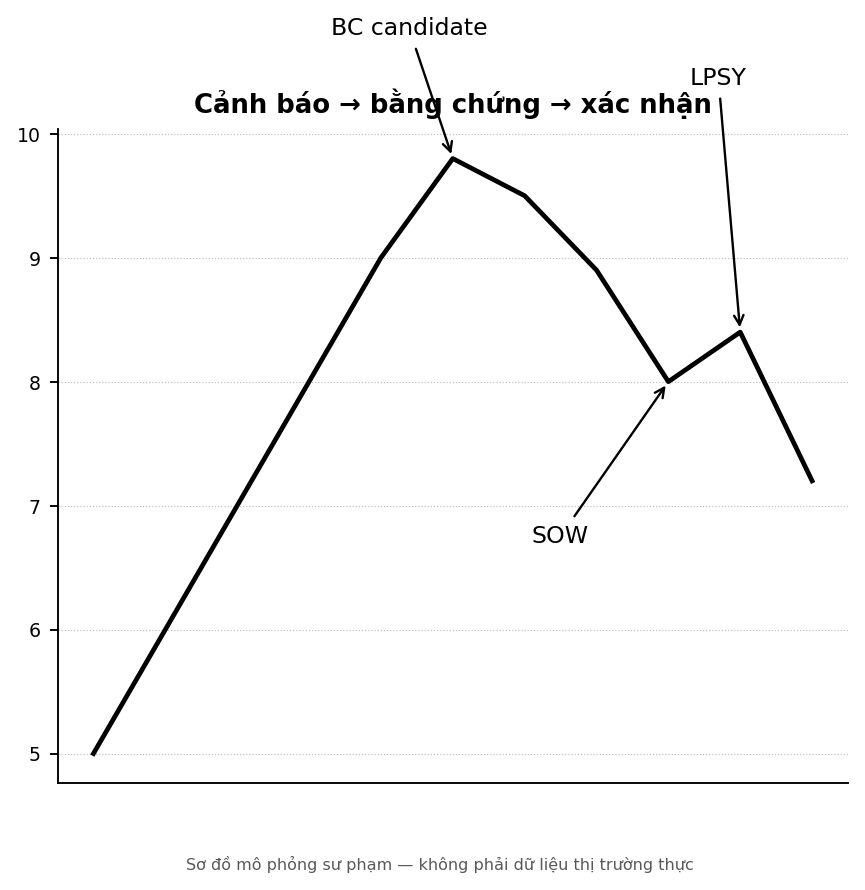

*Hình 31.1 — Cảnh báo → SOW → LPSY*
Viết kế hoạch cho người đang có vị thế lớn: làm gì tại BC candidate, SOW và LPSY?

## Lời giải và cách suy luận

Một kế hoạch phù hợp tinh thần khóa học: BC candidate ngừng add/cân nhắc trim; SOW giảm mạnh; LPSY thất bại lấy lại vùng → thoát phần còn lại.

## Tóm tắt chương

- Exit là quá trình quản trị bằng chứng.
- SOW mạnh hơn cảnh báo BC/UT.
- LPSY xác nhận Demand phản công yếu.

# Chương 32 — R:R và khoảng cách tới nền

## Mục tiêu chương

Hiểu vì sao một tín hiệu rất mạnh vẫn có thể là giao dịch không hấp dẫn nếu giá đã xa vùng vô hiệu.

Trong các bài tập, người học nhiều lần ưu tiên retest/LPS hơn một breakout bar mạnh vì khoảng cách tới support gần hơn và R:R tốt hơn.

## 1. Phân tích đúng ≠ entry tốt

Có thể nhận định đúng rằng SOS rất mạnh nhưng không mua vì stop xa, kháng cự kế tiếp gần hoặc giá đã chạy quá nhiều.

## 2. R:R phải dựa trên cấu trúc

Risk là khoảng từ entry tới invalidation hợp lý; Reward là khoảng tới vùng mục tiêu/khu vực có Supply. Không nên làm đẹp R:R bằng stop quá chặt trái cấu trúc.

## 3. Bỏ lỡ là chi phí chấp nhận được

Nếu giá breakout và không retest, trader thích entry LPS có thể bỏ lỡ. Đuổi giá chỉ để tránh FOMO phá vỡ quy trình.

## Sai lầm thường gặp

- **Tín hiệu mạnh = mua bằng mọi giá** Bỏ qua risk distance.
- **Stop chặt để R:R đẹp** Stop không còn gắn với luận điểm.
- **Không chấp nhận bỏ lỡ** Dễ mua đuổi.

## Checklist áp dụng

- Invalidation ở đâu?
- Khoảng cách risk có phù hợp?
- Kháng cự/mục tiêu gần nhất?
- Nếu không đạt tiêu chuẩn, có sẵn sàng bỏ lỡ?

## Bài tập

So sánh hai entry: breakout xa support và retest gần support. Viết lợi/nhược của từng lựa chọn mà không khẳng định một bên luôn tốt hơn.

## Lời giải và cách suy luận

Breakout có xác nhận nhanh nhưng risk distance có thể lớn; retest có R:R tốt hơn nhưng rủi ro không xuất hiện hoặc retest thất bại. Lựa chọn phụ thuộc hệ thống.

## Tóm tắt chương

- Strength và tradability là hai câu hỏi khác nhau.
- R:R phải dựa trên invalidation thật.
- Bỏ lỡ tốt hơn phá kỷ luật.

# Chương 33 — Khi nào không giao dịch?

## Mục tiêu chương

Biến ‘chờ’ thành một lựa chọn có điều kiện rõ ràng thay vì cảm giác do dự.

Một hệ thống tốt không chỉ nói khi nào mua. Nó phải nói khi nào **không nên giao dịch**.

## 1. Giữa Range

Không có lợi thế vị trí rõ, khoảng tới hai biên tương đối cân bằng và invalidation khó tối ưu.

## 2. Cấu trúc chưa phân loại

Range sau Markup chưa rõ Re-accumulation hay Distribution; bằng chứng hai phía cân bằng.

## 3. Tín hiệu đúng nhưng quá xa nền

R:R mua mới kém dù Strength vẫn có thể tiếp tục.

## 4. Markdown chưa dừng

Giá giảm sâu không phải lý do mua; cần stopping action và cấu trúc mới.

## 5. Thiếu dữ liệu cần thiết

Nếu không có Volume mà bài phân tích phụ thuộc VSA, phải hạ mức kết luận thay vì tự điền.

## Sai lầm thường gặp

- **Không giao dịch = sợ** Có thể là quyết định có lợi thế nhất.
- **Phải luôn có vị thế** Tạo overtrading.
- **Bỏ lỡ = sai** Bỏ lỡ theo kế hoạch là chi phí của kỷ luật.

## Checklist áp dụng

- Vị trí có edge?
- Bằng chứng có đủ?
- Invalidation có hợp lý?
- R:R có đạt tiêu chuẩn cá nhân?
- Có dữ liệu cần thiết không?

## Bài tập

Viết 5 câu ‘Tôi sẽ không giao dịch nếu…’ dựa trên các chương 23–32.

## Lời giải và cách suy luận

Một đáp án tốt có điều kiện khách quan: giữa Range; chưa rõ background; breakout bị kéo quá xa; invalidation quá rộng; chưa có Demand confirmation sau Spring; v.v.

## Tóm tắt chương

- Chờ là hành động có chủ đích.
- Không phải mọi tín hiệu đúng đều đáng giao dịch.
- Thiếu edge hoặc thiếu dữ liệu → đứng ngoài.

# PHẦN VIII — THỰC HÀNH ĐỌC BIỂU ĐỒ

# Chương 34 — Bài tập cấp 1: đọc một bar trong bối cảnh

## Mục tiêu chương

Luyện mô tả Price Action trước khi diễn giải và tách quan sát khỏi kết luận.

Bài tập cấp 1 cố ý đơn giản: trước tiên chỉ nhìn hình dạng nến. Không Volume, không nhãn Wyckoff.

## Quy trình

Với từng bar: Spread → Close → Wick → Result tăng/giảm → mức độ rejection. Sau đó mới ghi ‘chưa đủ dữ kiện về Supply/Demand’ nếu không có context.

## Checklist áp dụng

- Không gọi Spring/UT chỉ từ wick.
- Không gọi Demand/Supply chỉ từ màu nến.
- So sánh Spread giữa các bar.

## Bài tập

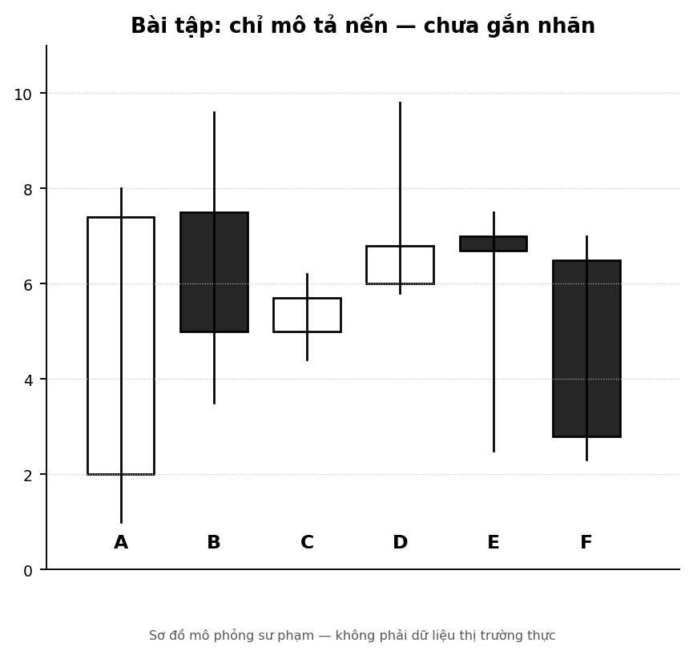

*Hình 34.1 — Sáu cây nến A–F, chưa có Volume*
Với A–F, ghi: Spread rộng/hẹp; Close; wick; rejection; bar nào chưa thể kết luận bên thắng.

## Lời giải và cách suy luận

A: Spread rộng, close cao, Result tăng rõ. B: Spread rộng nhưng close giữa, rejection phía trên đáng chú ý. C: Spread hẹp, Result nhỏ. D: wick trên lớn, vùng cao bị từ chối. E: râu dưới lớn và close cao hơn vùng thấp, rejection phía dưới. F: Spread rộng close gần Low, Result giảm rõ. **Không bar nào tự đủ để gọi sự kiện Wyckoff khi thiếu background/Volume.**

## Tóm tắt chương

- Mô tả trước, diễn giải sau.
- Một bar không tạo cấu trúc.
- Thiếu Volume/context phải hạ độ chắc chắn.

# Chương 35 — Bài tập cấp 2: đọc cụm 3–10 bar

## Mục tiêu chương

Chuyển từ nến đơn sang câu chuyện thay đổi Effort/Result qua một cụm ngắn.

Ở cấp này không cần tên Wyckoff ngay. Hãy tìm xem progress tăng/giảm, Spread và Volume đang mở rộng hay co lại, bên phản công mạnh lên hay yếu đi.

## Mẫu A — pullback lành mạnh

Sau Strength, 3 bar giảm có Spread/Volume co dần, support giữ; bar sau tăng Spread rộng Volume tăng. Câu chuyện: Supply giảm → Demand quay lại.

## Mẫu B — rally yếu

Sau Weakness, 3 bar tăng Spread hẹp Volume thấp, không lấy lại resistance; bar sau giảm mạnh. Câu chuyện: Demand yếu → Supply quay lại.

## Checklist áp dụng

- Xác định background trước cụm.
- So progress bar đầu với bar cuối.
- Ai đang bỏ Effort mà Result kém?
- Bar xác nhận cuối cụm làm gì?

## Bài tập

Tự tạo hai cụm 5 bar bằng số OHLC/Volume giả định: một cụm Supply yếu sau Strength và một cụm Demand yếu sau Weakness. Mô tả mà chưa dùng LPS/LPSY cho tới câu cuối.

## Lời giải và cách suy luận

Cụm một phải có pullback giảm co dần và Demand confirmation; khi có Strength background mới có thể gọi LPS/No Supply candidate. Cụm hai phải có rally yếu sau SOW và Supply quay lại; khi đó LPSY/No Demand candidate hợp lý hơn.

## Tóm tắt chương

- Cụm bar kể câu chuyện tốt hơn một bar.
- Progress và thay đổi Volume quan trọng.
- Tên sự kiện là kết luận sau bối cảnh.

# Chương 36 — Bài tập cấp 3: đọc Trading Range

## Mục tiêu chương

Luyện đọc hai biên, vị trí, thay đổi chất lượng rally/reaction và các giả thuyết Accumulation/Distribution.

Bài tập này không có nhãn. Người học phải tự xác định biên Range và tránh gán nhãn quá sớm.

## Trình tự

1) đánh dấu support/resistance như vùng; 2) so các lần test biên; 3) xem giá sống nửa trên hay dưới; 4) nhận diện acceptance/rejection; 5) mới lập giả thuyết.

## Checklist áp dụng

- Không mua giữa Range.
- Không gọi Spring/UT nếu thiếu background.
- So lần test hiện tại với lần test trước.

## Bài tập

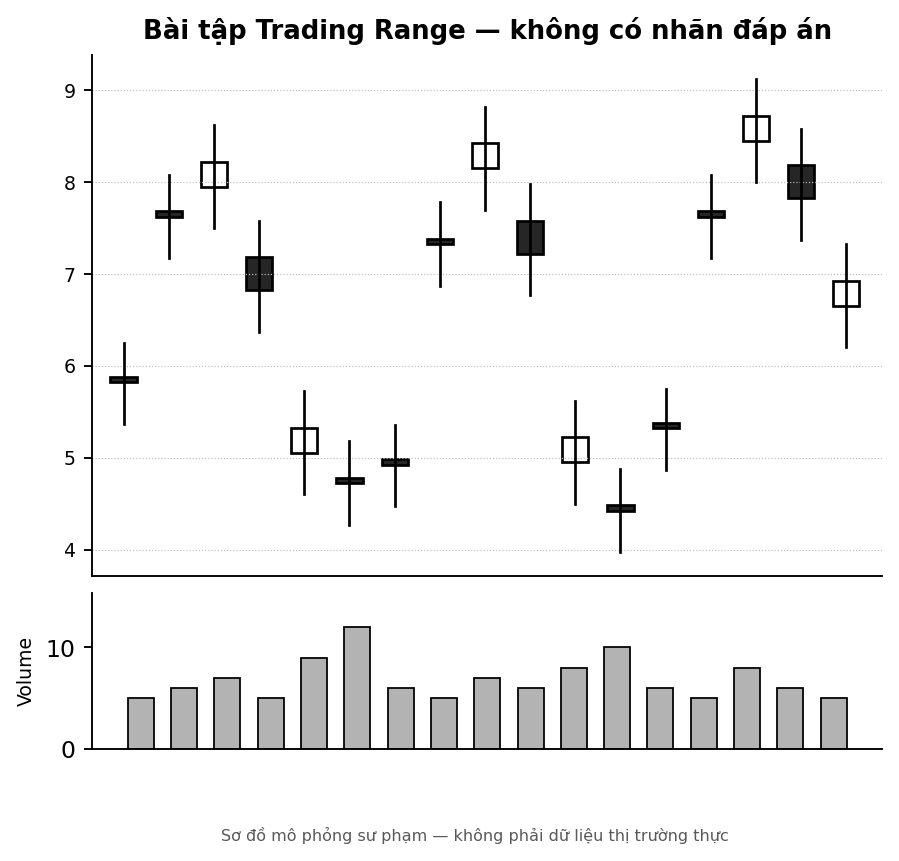

*Hình 36.1 — Trading Range chưa có nhãn đáp án*
Xác định support/resistance; lần test nào có Effort lớn nhất; reaction/rally thay đổi ra sao; giả thuyết nào đang mạnh dần?

## Lời giải và cách suy luận

Hình được thiết kế để luyện phương pháp chứ không chứa một ‘đáp án Wyckoff duy nhất’. Người học cần chỉ ra vùng thấp khoảng các đáy lặp và vùng cao khoảng các đỉnh lặp; so Volume mỗi lần test; chỉ khi thấy một phía mất hiệu quả mới nghiêng về absorption/phase progression.

## Tóm tắt chương

- Range cần đọc theo chuỗi test.
- Giữ giả thuyết trung tính khi bằng chứng cân bằng.
- Vị trí trong Range là thông tin lớn.

# Chương 37 — Bài tập cấp 4: đọc cả chu kỳ

## Mục tiêu chương

Thực hành từ trái sang phải trên toàn chu kỳ mà không dùng hindsight.

Sử dụng Hình 17.1 nhưng che nhãn các vùng. Mỗi lần chỉ mở thêm một đoạn bên phải.

## Nhiệm vụ

Tại mỗi mốc, ghi: pha candidate; bằng chứng mới; điều gì chưa biết; kịch bản A/B; hành động; invalidation.

## Tiêu chí chấm

Ưu tiên logic và mức độ phù hợp với dữ kiện tại thời điểm đó. Gọi đúng tên nhờ nhìn tương lai không được tính là phân tích tốt.

## Checklist áp dụng

- Candidate language.
- Không nhìn tương lai.
- Mỗi quyết định có invalidation.
- Phân biệt cảnh báo với xác nhận.

## Bài tập

*Hình 37.1 — Dùng lại sơ đồ chu kỳ để luyện đọc trái sang phải*
Che phần bên phải bằng giấy hoặc trên Kindle chỉ xem từng đoạn phóng to. Sau mỗi 3–5 điểm, dừng và ghi nhận định.

## Lời giải và cách suy luận

Không có một chuỗi nhãn duy nhất được chấm. Câu trả lời đạt yêu cầu phải thay đổi giả thuyết theo evidence: stopping action → Range candidate → Strength/SOS → Markup → climactic/distribution candidate → SOW/LPSY → Markdown.

## Tóm tắt chương

- Đọc thời gian thực khác với kể lại lịch sử.
- Phải biết điều gì chưa biết.
- Quản trị luận điểm quan trọng hơn đoán đúng nhãn.

# Chương 38 — Bài tập bẫy nâng cao

## Mục tiêu chương

Kiểm tra các cặp dễ nhầm: Spring/Breakdown, Breakout/UT, SOS/BC, LPS/LPSY, absorption hai chiều.

Đây là phần kiểm tra tích hợp của các Chương 22–27.

## Câu 1

Một bar phá support, rút chân và quay lại Range. Nêu hai giả thuyết và bằng chứng cần thấy ở 3 bar sau.

## Câu 2

Một bar tăng Spread rộng Volume cực lớn tại đỉnh mới. Nêu cách phân biệt SOS với BC candidate mà không dùng màu nến.

## Câu 3

Một rally Volume thấp: điều gì khiến nó là LPSY thay vì chỉ là Demand tạm nghỉ?

## Câu 4

Giá bám resistance, Volume tăng nhưng reaction nông dần: bên nào có thể đang bị hấp thụ?

## Checklist áp dụng

- Luôn nêu background.
- Nêu confirmation và invalidation.
- Không dùng một bar làm đáp án.

## Bài tập

Trả lời bốn câu trên theo cấu trúc: Bối cảnh → Price/Spread → Volume → Effort/Result → Supply/Demand → phản ứng cần chờ → hành động.

## Lời giải và cách suy luận

1) Spring candidate nếu rejection và Demand/Test; Breakdown nếu acceptance dưới. 2) SOS gần nền và Result bền; BC sau Markup dài và Result mất bền. 3) Phải có SOW/Weakness trước và rally không lấy lại resistance. 4) Supply có thể đang bị Demand hấp thụ; cần breakout/SOS xác nhận.

## Tóm tắt chương

- Các bẫy nâng cao đều quay về context + acceptance/rejection + Effort/Result.
- Không học thuộc hình.
- Confirmation quyết định hành động.

# Chương 39 — Bài tập lập kế hoạch giao dịch

## Mục tiêu chương

Biến phân tích Wyckoff/VSA thành kế hoạch có entry, invalidation, add, giảm vị thế và exit.

Bài này kiểm tra khả năng chuyển từ ‘đọc đúng’ sang ‘hành động có quản trị’.

## Mẫu kế hoạch

Giả thuyết chính; giả thuyết thay thế; entry sớm; entry xác nhận; entry cân bằng; invalidation; điều kiện add; điều kiện giảm; điều kiện thoát; trường hợp không giao dịch.

## Không ép phải có giao dịch

Nếu Range giữa hoặc R:R kém, kế hoạch tốt có thể là đứng ngoài.

## Checklist áp dụng

- Entry có lý do cấu trúc.
- Invalidation rõ.
- Không add khi evidence xấu đi.
- Exit có tầng cảnh báo/bằng chứng/xác nhận.
- Có kịch bản thay thế.

## Bài tập

Chọn một trong các hình 23–26 và lập kế hoạch đầy đủ. Không được dùng câu ‘nếu thấy xấu thì bán’; mọi điều kiện phải quan sát được.

## Lời giải và cách suy luận

Đáp án tốt dùng các điều kiện như acceptance dưới support, breakout giữ trên resistance, retest Volume thấp, SOW, LPSY… thay vì cảm xúc. R:R phải được xét trước entry.

## Tóm tắt chương

- Phân tích chỉ có giá trị khi chuyển thành kế hoạch.
- Kế hoạch cần điều kiện quan sát được.
- Không giao dịch là phương án hợp lệ.

# Chương 40 — Thực hành từng bước không nhìn tương lai

## Mục tiêu chương

Thiết lập phương pháp luyện ‘live-like’: chỉ dùng dữ liệu có sẵn tới bar hiện tại, ghi giả thuyết và cập nhật sau mỗi bar.

Mục tiêu tiếp theo của khóa học là đọc biểu đồ như đang diễn ra thật. Nguồn hiện có đã xác định mục tiêu này nhưng chưa chứa một bộ dữ liệu bar-by-bar hoàn chỉnh, vì vậy chương tập trung vào **quy trình luyện**, không tự dựng một case thị trường thật.

## 1. Cách luyện

Chọn biểu đồ lịch sử hoặc dữ liệu đã xác minh; che phần tương lai. Mỗi lần mở 1–3 bar, ghi context, phase candidate, Supply/Demand, kịch bản, hành động và invalidation.

## 2. Nhật ký giả thuyết

Không sửa dự đoán cũ sau khi đã thấy tương lai. Ghi rõ ‘tại bar N tôi nghĩ… vì…’; bar N+1 xác nhận/phủ định gì.

## 3. Chấm logic thay vì chấm dự đoán

Nếu giả thuyết hợp lý nhưng bị thị trường phủ định và trader xử lý đúng invalidation, đó vẫn là bài làm tốt.

## 4. Trạng thái nguồn

Để xây phần thực hành hoàn chỉnh bằng dữ liệu thật, cần bổ sung biểu đồ/dữ liệu nguồn đã được xác minh. Không sử dụng hình AI tưởng tượng để thay thế case kỹ thuật cuối cùng.

## Sai lầm thường gặp

- **Nhìn trước dữ liệu** Tạo hindsight bias.
- **Xóa nhận định sai** Mất dữ liệu học tập quan trọng.
- **Chấm điểm bằng việc giá có đi đúng dự đoán** Bỏ qua chất lượng suy luận và quản trị rủi ro.

## Checklist áp dụng

- Đã che tương lai?
- Ghi timestamp/bar index cho nhận định?
- Có candidate language?
- Có kịch bản thay thế?
- Có invalidation?
- Sau bar mới, cập nhật chứ không viết lại quá khứ?

## Bài tập

Tạo một bảng 10 dòng: Bar/Context/Hypothesis/Evidence/Action/Invalidation/What changed. Dùng một biểu đồ thật do người học tự cung cấp và điền từng dòng khi mở thêm dữ liệu.

## Lời giải và cách suy luận

Không có lời giải cố định vì chưa có case dữ liệu thật trong nguồn hiện tại. Tiêu chí đánh giá là tính nhất quán của quy trình và khả năng cập nhật theo bằng chứng.

## Tóm tắt chương

- Không nhìn tương lai là kỹ năng thực chiến cốt lõi.
- Giữ lại nhận định sai để học.
- Đánh giá quy trình, không chỉ kết quả.
- Case kỹ thuật cuối cùng cần dữ liệu thật/xác minh.

# PHỤ LỤC A — Bảng thuật ngữ

| Thuật ngữ | Ý nghĩa sử dụng trong sách |
|---|---|
| Price Action | Hành vi giá thể hiện qua OHLC, Spread, Close, wick, cấu trúc và phản ứng |
| Volume | Mức giao dịch/Effort; không tự nói ai thắng |
| Spread | High − Low của bar |
| Effort | Nỗ lực, trong khung VSA của khóa học chủ yếu đọc qua Volume |
| Result | Mức giá di chuyển, Spread, Close và khả năng duy trì/tiếp diễn |
| Supply | Áp lực bán; đánh giá qua hiệu quả của nhịp giảm/phản ứng |
| Demand | Áp lực mua; đánh giá qua hiệu quả của rally/Strength |
| SC | Selling Climax — vùng bán cực điểm/stopping candidate sau Markdown |
| AR | Automatic Rally/Reaction — phản ứng tự động sau climax |
| ST | Secondary Test — kiểm tra lại vùng climax |
| Spring | Phá dưới support rồi bị từ chối trong Accumulation background |
| Test | Kiểm tra Supply/Demand với Effort/Result thấp hơn sau một sự kiện |
| SOS | Sign of Strength — Strength có Result cấu trúc |
| LPS | Last Point of Support — Supply yếu sau Strength/SOS |
| PSY | Preliminary Supply — dấu hiệu Supply sơ bộ sau Markup |
| BC | Buying Climax — climactic candidate sau Markup dài |
| UT | Upthrust — vượt resistance rồi bị từ chối |
| UTAD | Upthrust After Distribution — upthrust muộn trong Distribution |
| SOW | Sign of Weakness — Weakness có Result cấu trúc |
| LPSY | Last Point of Supply — Demand yếu sau Weakness/SOW |
| Acceptance | Thị trường duy trì giao dịch ở phía bên kia vùng vừa phá |
| Rejection | Thử vùng mới nhưng không giữ được, quay lại vùng cũ |
| Absorption | Quá trình một bên bỏ Effort nhưng tạo Result ngày càng nhỏ |

# PHỤ LỤC B — Checklist đọc biểu đồ

1. Thị trường chung đang tăng, giảm hay đi ngang?
2. Cổ phiếu đang ở Accumulation, Markup, Distribution hay Markdown candidate?
3. Giá ở đâu: biên dưới, giữa Range, biên trên, breakout hay retest?
4. Spread đang mở rộng hay thu hẹp?
5. Close nằm ở đâu trong Spread?
6. Wick cho thấy vùng nào bị từ chối?
7. Volume cao/thấp so với các bar liên quan?
8. Effort và Result tương xứng không?
9. Supply/Demand bên nào đang mất hiệu quả?
10. Bar sau xác nhận hay phủ định?
11. Nếu giao dịch: entry, invalidation, R:R?
12. Nếu không đủ bằng chứng: chờ.

# PHỤ LỤC C — Checklist kế hoạch lệnh

- Giả thuyết chính.
- Giả thuyết thay thế.
- Điều kiện vào sớm.
- Điều kiện vào xác nhận.
- Điều kiện vào cân bằng/retest.
- Điểm/vùng vô hiệu.
- Điều kiện gia tăng.
- Điều kiện ngừng gia tăng.
- Cảnh báo giảm vị thế.
- Bằng chứng giảm mạnh.
- Điều kiện thoát phần còn lại.
- Trường hợp không giao dịch.

# PHỤ LỤC D — Các nguyên tắc xuyên suốt khóa học

> **Không bao giờ đánh giá một cây nến tách khỏi bối cảnh.**

> **Volume không nói cho ta biết bên nào thắng; Price Action sau Volume giúp xác định bên nào thắng.**

> **Effort lớn nhưng Result nhỏ = phải nghi ngờ lực đối ứng.**

> **Hỗ trợ và kháng cự là vùng, không phải một đường tuyệt đối.**

> **Breakout chỉ có ý nghĩa khi thị trường chấp nhận giá phía bên kia vùng breakout.**

> **Không dự đoán chắc chắn; xây dựng kịch bản và chờ xác nhận.**

> **Cùng một Price + Volume ở vị trí khác nhau có thể mang ý nghĩa hoàn toàn khác nhau.**

> **Trader không cần đúng mọi lần; cần quản trị rủi ro khi sai.**

> **Mục tiêu đầu tiên là sống sót và bảo toàn vốn.**

# PHỤ LỤC E — Trạng thái nội dung cần bổ sung ở phiên bản sau

Nguồn hiện có chưa đủ để viết một bài kỹ thuật độc lập về **Professional Buying / Professional Selling** và chưa có bộ **case bar-by-bar dữ liệu thị trường thật** để hoàn thiện phần thực hành thời gian thực. Những phần này được đánh dấu rõ trong Chương 21 và Chương 40. Khi có nguồn mới, có thể cập nhật mà không thay đổi phương pháp luận đã duyệt.
