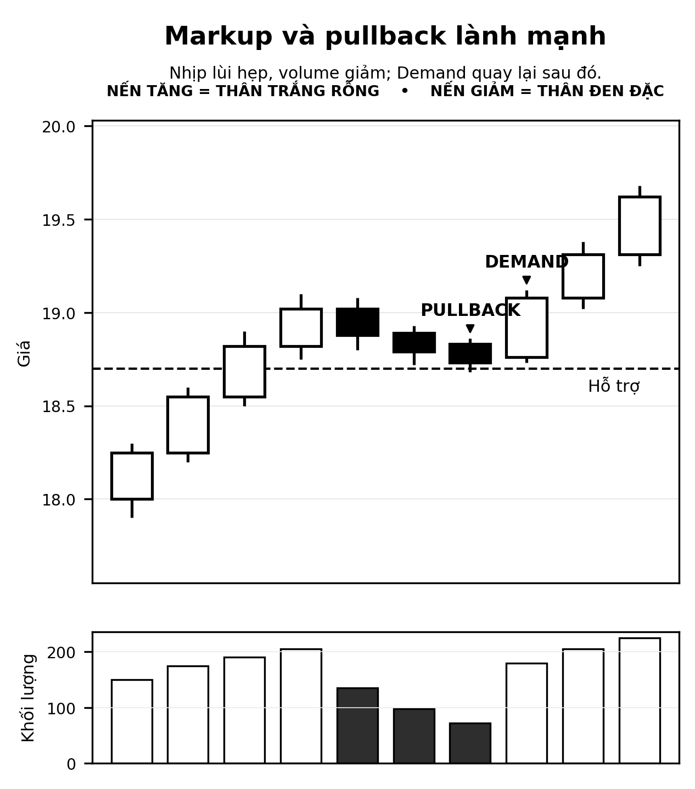
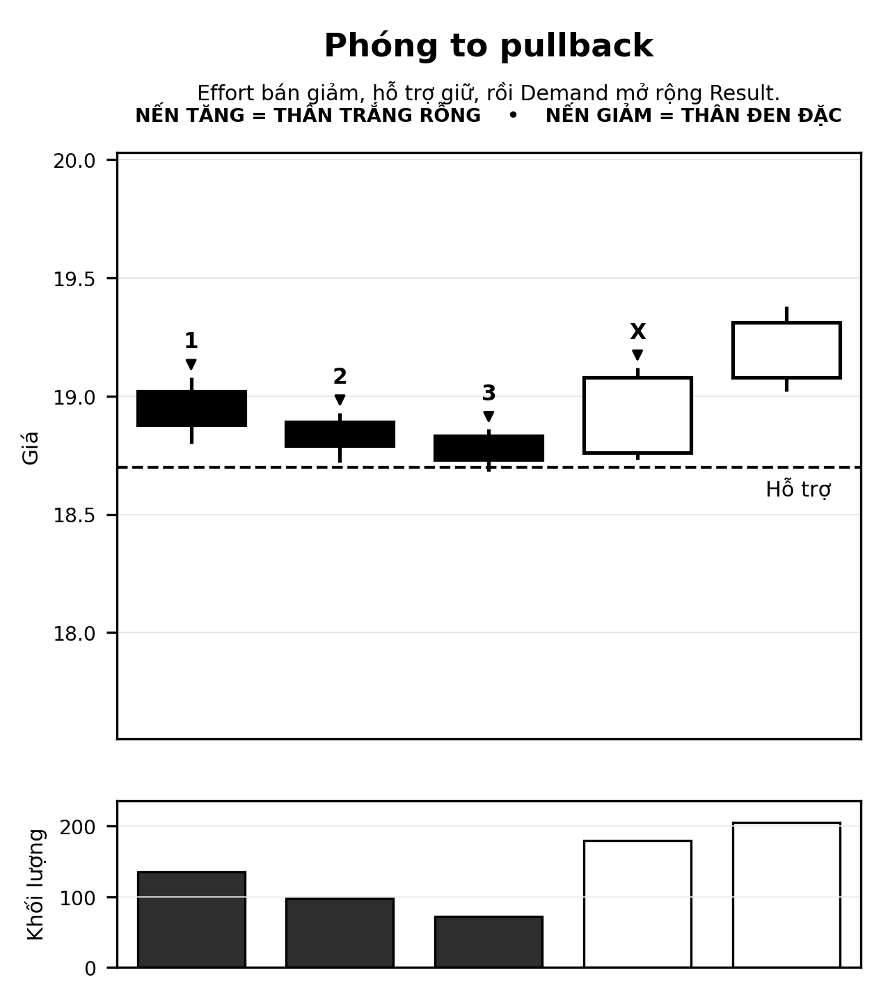
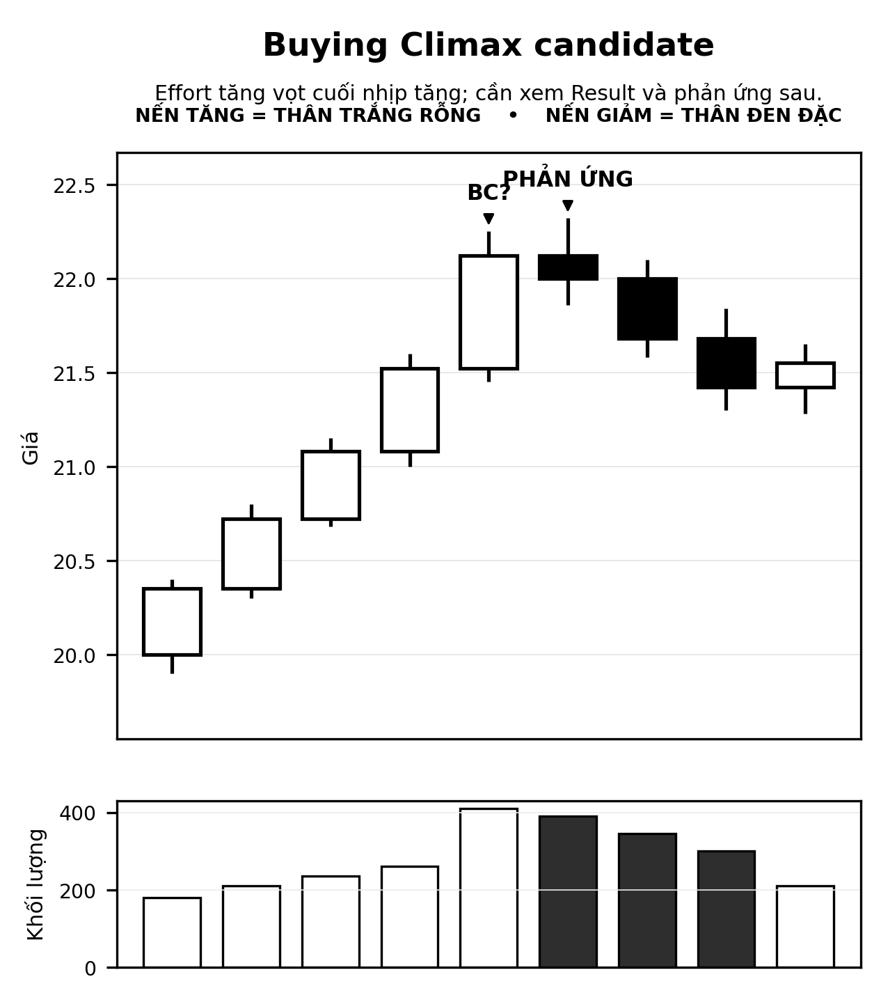
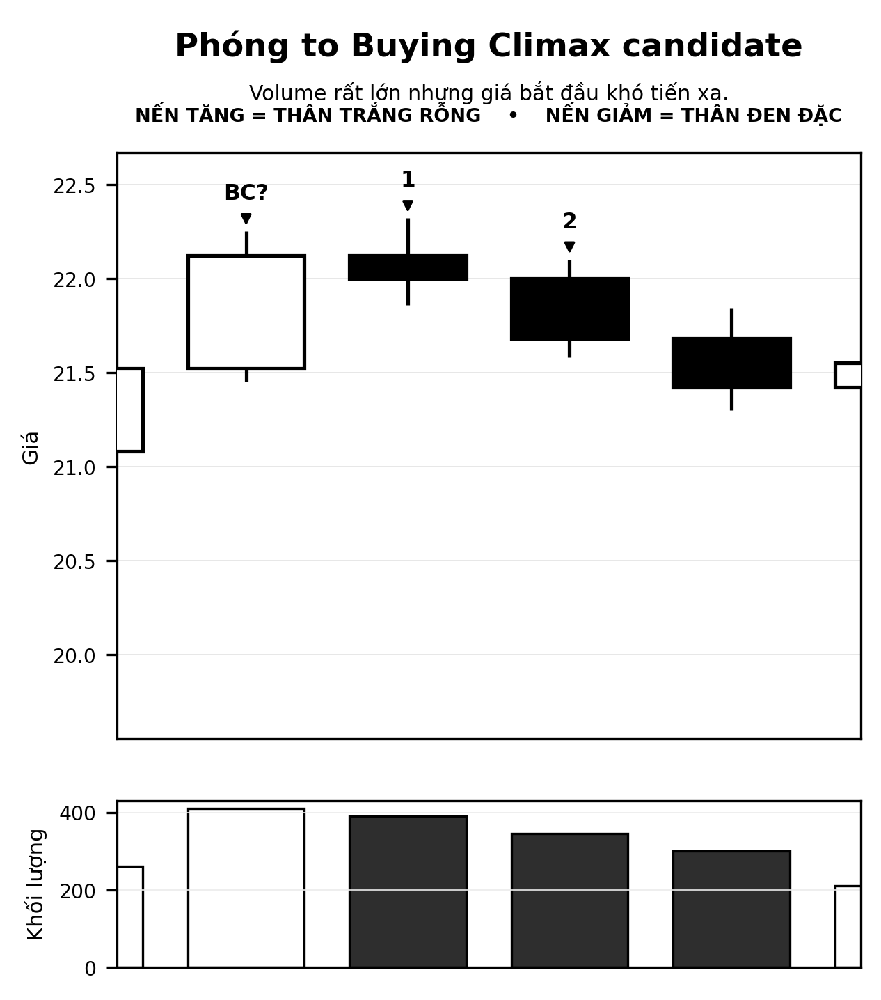

# Markup lành mạnh và Buying Climax

## 1. Mục tiêu

Bài này nối tiếp SOS/LPS để đọc Markup và nhận biết khi Effort tăng rất mạnh nhưng Result không còn tương xứng.

## 2. Markup lành mạnh

Trong phần khóa học đã ghi lại, nguyên tắc là không nhìn mọi nến tăng mạnh như một tín hiệu giống nhau. Cần đọc Volume, Spread, vị trí, vùng kháng cự và bối cảnh.

Một nhịp điều chỉnh lành mạnh có thể có:

- giá giảm nhẹ;
- Volume giảm;
- Spread hẹp;
- không phá hỗ trợ;
- sau đó Volume tăng;
- Spread mở rộng;
- Close gần High.

Đó có thể là dấu hiệu Demand quay lại nếu bối cảnh và vị trí phù hợp.

## 3. Biểu đồ tổng quan

## 4. Phóng to pullback và Demand quay lại

Cách đọc:

1. trước đó đã có Strength;
2. nhịp lùi có Effort bán giảm;
3. Spread hẹp;
4. hỗ trợ giữ;
5. bar sau xuất hiện Demand với Spread tốt và Close cao.

## 5. Buying Climax candidate

Sau khi giá đã tăng rất xa khỏi nền, nếu xuất hiện:

- giá tăng rất mạnh;
- Volume cực lớn;
- Close gần High;

thì không được mặc định rằng đây luôn là tín hiệu Strength.

Trong khóa học, vùng này có thể là Buying Climax candidate hoặc vùng rủi ro cao. Cần quan sát phản ứng sau đó.

## 6. Biểu đồ Buying Climax candidate

## 7. Phóng to phản ứng sau Buying Climax candidate

Nếu sau Effort cực lớn, giá không tiến xa hoặc bắt đầu suy yếu, giả thuyết Supply đối ứng tăng độ tin cậy. Nếu giá tiếp tục giữ Strength và Volume bình thường hóa, chưa thể chỉ dựa vào bar climax để kết luận Distribution.

## 8. Câu hỏi của thầy – phục dựng theo mạch khóa học

1. Một bar tăng Spread rộng, Volume rất lớn ở cuối một nhịp tăng dài có phải luôn là SOS không?
2. Khi nào nó có thể là Buying Climax candidate?
3. Tại sao phải xem các bar sau?
4. Điều gì cho thấy Strength vẫn còn duy trì?

## 9. Sai lầm phổ biến

- Volume cực lớn = Demand cực mạnh.
- Thấy Buying Climax candidate là kết luận Distribution ngay.
- Bỏ qua khoảng cách từ giá tới nền/hỗ trợ.
- Không xem follow-through.
- Không phân biệt candidate và confirmed.

## 10. Checklist

1. Giá đang ở đầu, giữa hay cuối Markup?
2. Đã đi xa khỏi nền chưa?
3. Effort lớn tạo Result tương xứng không?
4. Có râu trên hoặc Close kém không?
5. Các bar sau có tiếp tục Strength không?
6. Hỗ trợ gần nhất ở đâu?

## 11. Kết chương

> Trong Markup, Strength cho phép tiếp tục theo dõi xu hướng; nhưng khi Effort tăng vọt mà Result không còn tương xứng, phải chuyển sang quan sát rủi ro và chờ xác nhận.
