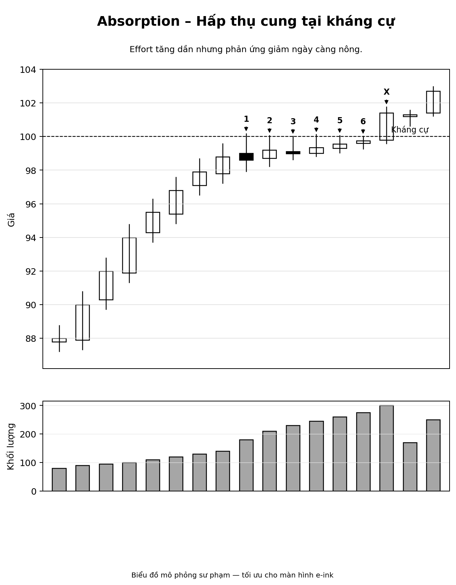
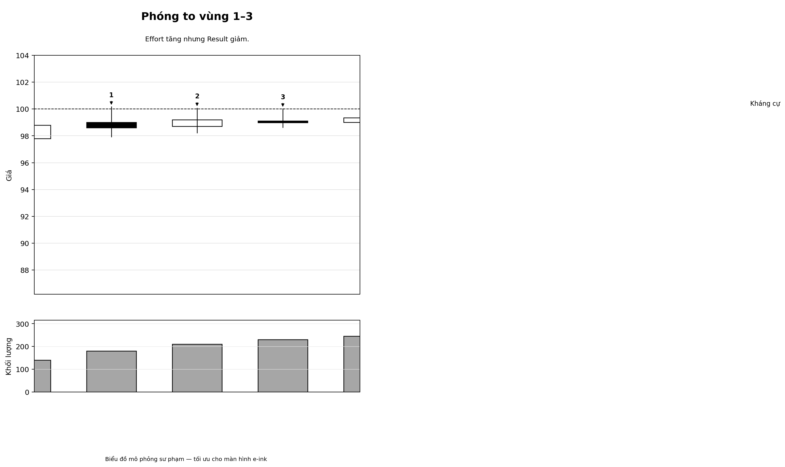
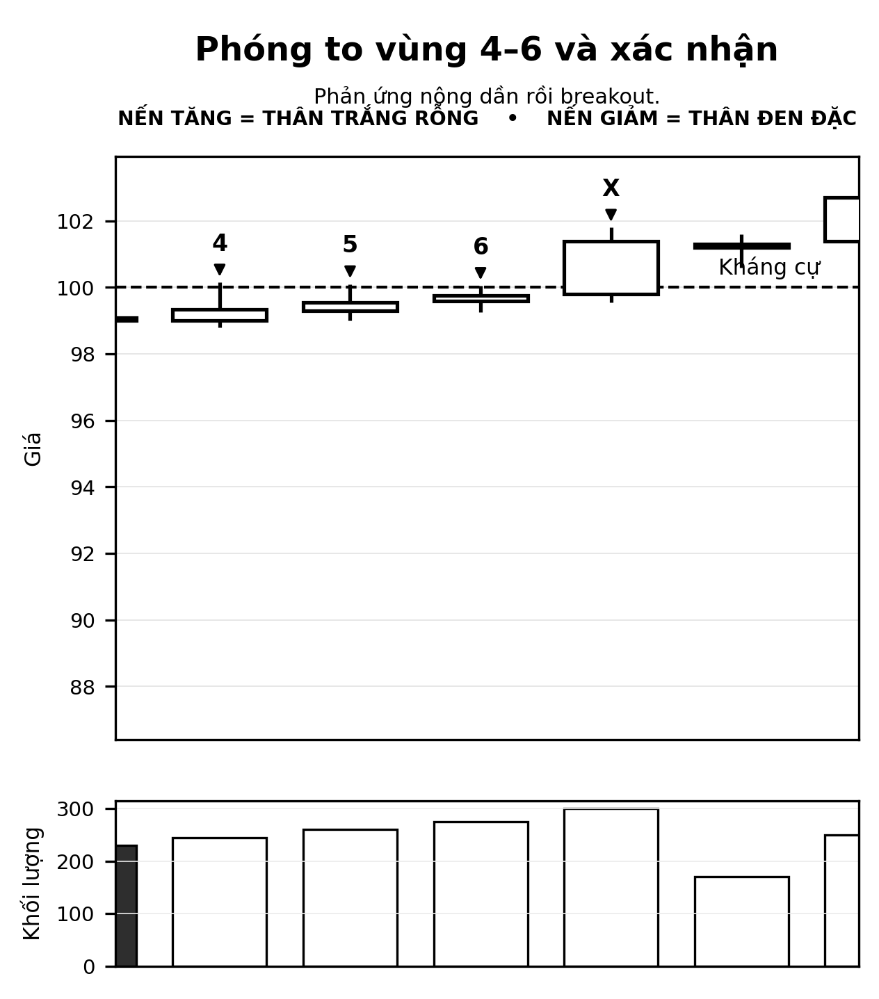
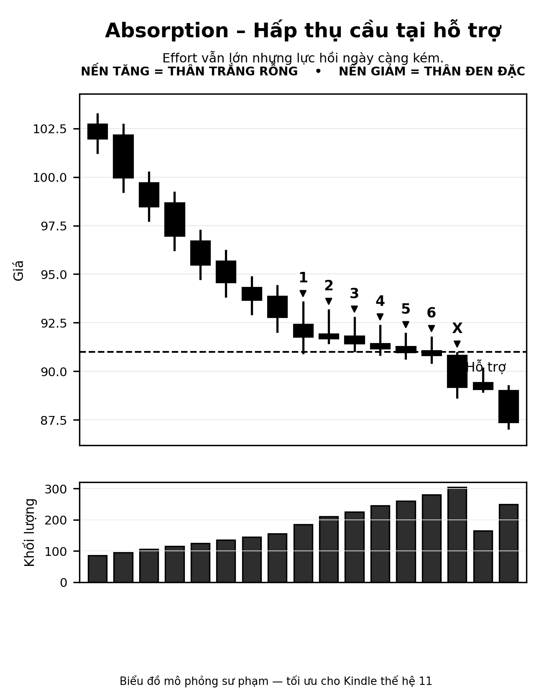
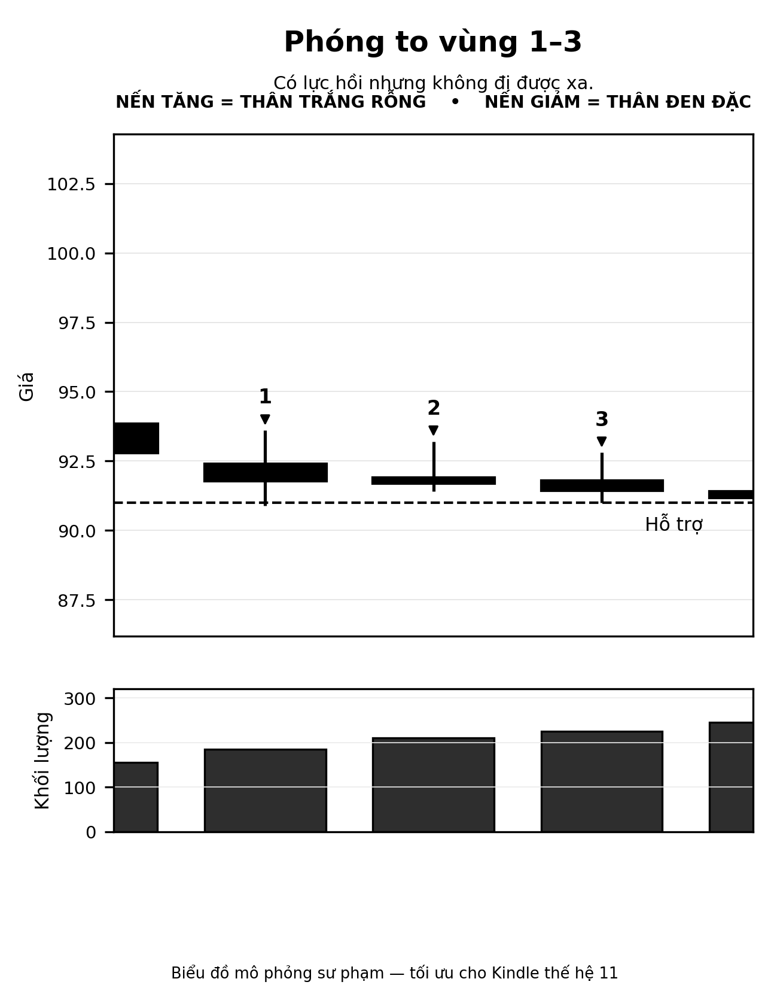
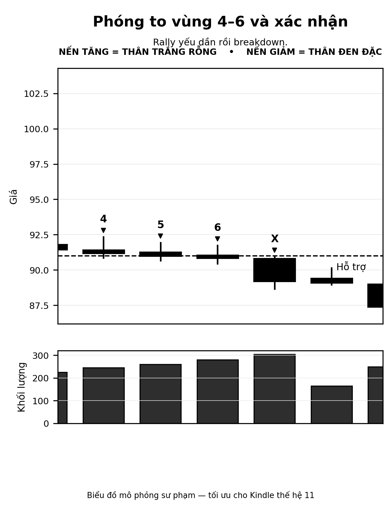
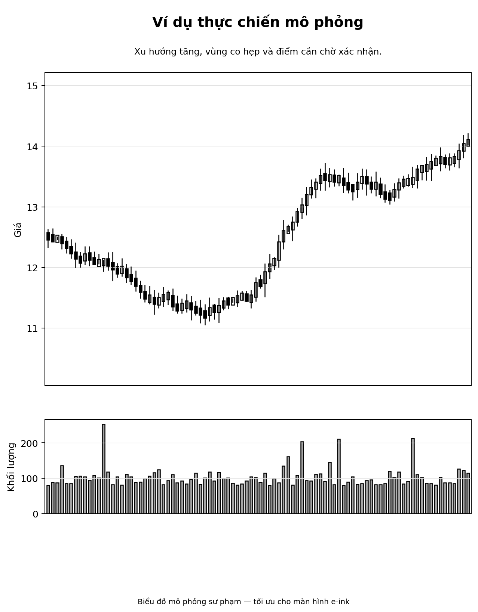
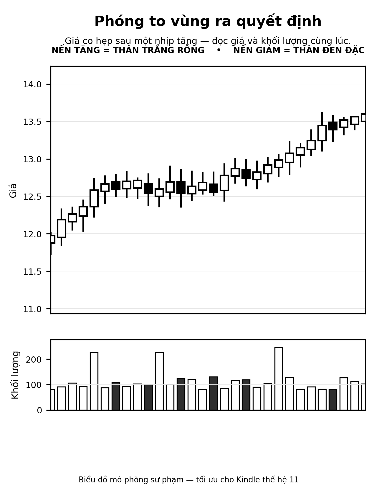

## 1. Mục tiêu bài học

Sau chương này, người học cần nắm được:

- Absorption là gì.
- Vì sao không được vội gọi một vài cây nến là tích lũy hay phân phối.
- Cách đọc **Effort** và **Result** trong bối cảnh có tranh chấp cung/cầu mạnh.
- Sự khác nhau giữa:
  - **hấp thụ cung** gần kháng cự;
  - **hấp thụ cầu** gần hỗ trợ.
- Cách chờ xác nhận thay vì kết luận sớm.
- Cách ra quyết định khi:
  - đang cầm tiền mặt;
  - đang có sẵn vị thế;
  - thị trường chưa xác nhận dứt khoát.

## 2. Lý thuyết cốt lõi

### 2.1. Absorption là gì?

**Absorption** là hiện tượng một bên liên tục tung ra lực lớn, nhưng hiệu quả đẩy giá theo hướng mong muốn lại **giảm dần**. Nói đơn giản:

- có **nỗ lực** lớn;
- nhưng **kết quả** tương xứng lại không còn nhiều.

Điều này thường cho thấy có một lực đối ứng đang âm thầm hấp thụ ở phía bên kia.

### 2.2. Effort và Result trong bài này

Trong ngôn ngữ VSA:

- **Effort** chủ yếu được đọc qua **Volume**.
- **Result** được đọc qua:
  - độ rộng thân nến / spread;
  - vị trí đóng cửa;
  - khả năng đi tiếp hay bị chặn lại;
  - độ sâu của nhịp phản ứng sau đó.

Câu hỏi trung tâm không phải là:

> “Volume lớn là tốt hay xấu?”

Mà là:

> “Volume lớn đó có tạo ra kết quả tương xứng không?”

### 2.3. Hấp thụ cung gần kháng cự

Khi giá đi lên vùng kháng cự, nếu liên tục xuất hiện các lần thử với volume cao mà:

- phản ứng giảm về sau **nông dần**;
- giá **không bị đẩy lùi sâu** nữa;
- mỗi lần bị bán xuống nhưng lại hồi trở lại khá nhanh;

thì có thể hình thành giả thuyết:

> **Cung đang được cầu hấp thụ.**

Tuy nhiên, đây **chưa phải xác nhận**. Xác nhận chỉ mạnh hơn khi sau đó xuất hiện:

- breakout vượt kháng cự;
- giữ được vùng vượt;
- hoặc có retest với volume thấp rồi đi lên lại.

### 2.4. Hấp thụ cầu gần hỗ trợ

Ngược lại, nếu giá đi xuống vùng hỗ trợ, nhiều lần hồi lên nhưng:

- càng hồi càng yếu;
- effort lớn mà giá hồi không đi xa;
- cuối cùng hỗ trợ bị xuyên thủng;

thì có thể hình thành giả thuyết:

> **Cầu đang bị cung hấp thụ.**

Xác nhận sẽ đến khi:

- breakdown thủng hỗ trợ;
- giá không lấy lại được hỗ trợ;
- cú hồi sau breakdown yếu.

### 2.5. Điều cực quan trọng: Absorption là quá trình, không phải một cây nến

Sai lầm phổ biến nhất là nhìn một cây volume lớn rồi kết luận ngay:

- đây là tích lũy;
- đây là phân phối;
- đây là hấp thụ cung;
- hoặc đây là hấp thụ cầu.

Cách đọc đúng là:

1. nhìn **bối cảnh**;
2. nhìn **vị trí**;
3. nhìn **chuỗi hành vi**;
4. rồi mới nhìn **xác nhận phía sau**.

### 2.6. Không được nhầm “tranh chấp” với “xác nhận”

Volume lớn + spread hẹp thường cho thấy:

> Hai bên đang giao chiến mạnh.

Nhưng đó mới chỉ là **tranh chấp**. Muốn biết bên nào thắng, ta cần xem tiếp:

- giá có vượt kháng cự không;
- có giữ được không;
- có retest lành mạnh không;
- hay giá bị kéo ngược xuống.

---

## 3. Biểu đồ tổng quan – Hấp thụ cung tại kháng cự

Hình trên mô phỏng chính kiểu bài học đã được dùng để giảng phần đầu của chương này:

- giá đi lên vào vùng kháng cự;
- nhiều lần chạm kháng cự;
- volume tăng dần;
- nhưng nhịp phản ứng giảm ngày càng nông.

### Cách đọc nhanh

- **Nến 1–3:** bắt đầu xuất hiện sự bất cân xứng giữa Effort và Result.
- **Nến 4–6:** volume còn lớn nhưng mỗi lần đẩy xuống không còn hiệu quả như trước.
- **Nến X:** là phần xác nhận, khi giá thật sự thoát lên khỏi kháng cự.

## 4. Biểu đồ phóng to – vùng 1 đến 3

Điểm cần nhìn ở đoạn này không phải chỉ là “volume cao”, mà là:

- có bán ra khá mạnh;
- nhưng giá không bị ép lùi xa;
- nhịp giảm xuống dưới biên trên không sâu;
- bối cảnh bắt đầu nghiêng sang khả năng **cung đang được hấp thụ**.

## 5. Biểu đồ phóng to – vùng 4 đến 6 và xác nhận

Đây là đoạn mấu chốt của bài:

- thị trường vẫn chưa cho quyền khẳng định chắc chắn quá sớm;
- nhưng càng về sau, những cú phản ứng giảm càng kém hiệu quả;
- khi giá bứt lên và giữ được vùng vừa vượt, giả thuyết hấp thụ cung mới được nâng độ tin cậy.

---

## 6. Biểu đồ đối ứng – Hấp thụ cầu tại hỗ trợ

Đây là mặt ngược lại của cùng một nguyên lý:

- giá đi xuống vùng hỗ trợ;
- nhiều lần cố hồi lên;
- volume không nhỏ;
- nhưng lực hồi ngày càng kém.

## 7. Biểu đồ phóng to – vùng 1 đến 3

Ở đây ta không được nhầm những cú hồi nhỏ là dấu hiệu khỏe. Phải nhìn xem:

- hồi được bao xa;
- đóng cửa ra sao;
- lần hồi sau có yếu đi không.

## 8. Biểu đồ phóng to – vùng 4 đến 6 và xác nhận

Khi hỗ trợ bị xuyên thủng, cú hồi sau đó yếu, thị trường cho thấy bên mua không còn giữ được vùng giá đó nữa.

---

## 9. Bài tập của thầy – bản phục dựng theo đúng mạch trao đổi

Trong transcript truy xuất được, phần mở bài tập không còn hiện trọn vẹn từng lượt. Tuy nhiên từ phần trả lời của học viên và phần phản hồi tiếp theo, có thể phục dựng khá chắc mạch câu hỏi ban đầu như sau:

### Bài tập gốc (phục dựng biên tập)

Quan sát một chuỗi **6 phiên** đi lên vùng kháng cự trong một Trading Range. Đặc điểm nổi bật:

- Phiên 2 và 3 có nỗ lực lớn nhưng kết quả không tương xứng.
- Giá đang ở vùng biên trên của Range.
- Đến phiên 6, giá vẫn chưa vượt hẳn kháng cự.

**Câu hỏi:**

1. Bối cảnh lúc này đã đủ để kết luận là **tích lũy** hay **phân phối** chưa?
2. Phiên 2 và 3 cho thấy điều gì về **Effort – Result**?
3. Nếu đang cầm tiền mặt, có nên mua ở phiên 6 không?
4. Nếu đã có sẵn vị thế, nên xử lý thế nào?
5. Cần chờ thêm tín hiệu gì để xác nhận hấp thụ cung?

---

## 10. Câu trả lời của học viên – nguyên văn trích từ cuộc hội thoại

### 10.1. Câu trả lời chính

> “Theo tôi bối cảnh hiện tại chưa đủ dữ kiện để khẳng định là tích lũy hay phân phối. Phiên 2 và 3 cho ta thấy sự phân kỳ giữ nỗ lực và kết quả. Nỗ lực rất lớn nhưng kết quả không đáng kể cho thấy lượng cung ở vùng giá này còn rất lớn. Đây chưa thể nói là hấp thụ cung hay hấp thụ cầu, nó chỉ cho ta thấy ở vùng này cung cầu gặp nhau nên khối lượng giao dịch lớn. Để khẳng định là hấp thụ cung hay cầu thì ta cần đọc diễn biến các phiên tiếp theo. Nếu trong 3-5 phiên tiếp theo giá vượt kháng cự dứt khoát và ko quay lại vùng kháng cự thì ta xác nhận đoạn trước là hấp thụ cung. Ngược lại các phiên sau cho thấy giá giảm thủng hỗ trợ và không quay lại range thì ta cho là hấp thụ cầu. Nếu tôi đang cầm tiền mặt tôi chắc chắn sẽ ko mua ở phiên thứ 6. Vì phiên này cho ta thấy lỗ lực rất lớn nhưng kết quả rất thấp. Giá lại đang ở vùng biên trên của range, gặp kháng cự mà chưa vượt được. Mua như vậy rất nguy hiểm. Là tôi để bảo toàn nếu có sẵn hàng tôi sẽ bán 1/2 và chờ diến biến tiếp theo. Nếu 3-5 phiên tiếp theo giá vượt kháng cự, quay lại test vùng kháng cự đã vượt qua với vol thấp tôi sẽ mua lại 1/2 đó thậm chí mua thêm. Nếu các phiên sau ko vượt được kháng cự mà giá giảm, đóng cửa thấp, vol trung bình hoặc cao tôi sẽ thoát toàn bộ hàng.”

### 10.2. Một nhận xét của thầy còn truy xuất được trong transcript

> “Điểm thứ ba: quyết định bán 1/2 ở phiên 6. Đây là phần thầy chỉ cho 7,5/10, không phải vì nó sai, mà vì con đang hơi chuyển từ đọc thị trường sang quy tắc cứng.”

### 10.3. Câu hỏi nối tiếp của học viên

> “Nếu là thầy khi giá đã tăng một mạch từ vùng hỗ trợ lên kháng cự, điều kiện 6 cây nến như thầy nói. RSI đã ở vùng quá mua vùng 7x -8x thầy có bán bớt hàng ra không?”

### 10.4. Câu trả lời bổ sung của học viên về kịch bản phiên kế tiếp

> “trường hợp nến giảm spread hẹp vol thấp hơn tôi vẫn giữ hàng chờ tín hiệu tiếp theo. Nếu nến tăng spread rộng, đóng cửa high gần đỉnh, vol 1,5-2 lần tôi cho là cổ phiếu vào nhịp markup sẽ mua ra tăng 1 phần tại giá đóng cửa. 1 phần còn lại tôi chờ nếu có nhịp quay lại test với vol thấp, đóng cửa ko thấp, giá ko thủng hỗ trợ thì mua.”

### 10.5. Phản biện tiếp theo của học viên về cách đặt giả thiết

> “Thứ nhất câu hỏi của thầy đang về phiên kế tiếp chứ không phải là vài phiên tiếp theo nên giả định sau của thầy nếu nó cứ giảm hẹp, volume thấp nhưng từng bước trượt xuống dưới 17,2 rồi 17,0 nằm là giả thiết mở rộng ra các phiên tiếp theo nằm ngoài giả thiết ban đầu. Thứ 2 tôi đồng ý với thầy là ko thể khẳng định markup từ 1 cây nến. Nhưng ở đây tôi đã đọc bối cảnh từ trươc, diễn biến giá đang có 1 vùng đi ngang biên hẹp. Nếu theo giả thiết thứ 2 của thầy giá tăng mạnh , spread rộng, đóng cửa cao. Vol gấp 1,5-2 lần Ma20. Như vậy Spread rộng, đóng cửa high thì giá phải vượt vùng kháng cự là 17x-18. Nên tôi khẳng định là Markup”

---

## 11. Cách lập luận của thầy cho bài này

### 11.1. Điểm học viên làm tốt

Có ba ý rất tốt trong câu trả lời của học viên:

1. **Không vội kết luận tích lũy hay phân phối.**  
   Đây là tư duy đúng. Ở giai đoạn đang tranh chấp, điều đúng nhất nhiều khi là nói: **“chưa đủ dữ kiện.”**

2. **Đọc đúng phân kỳ Effort – Result ở các phiên có volume lớn.**  
   Học viên nhìn ra rằng nỗ lực lớn nhưng kết quả nhỏ **không tự động đồng nghĩa với tăng hay giảm**, mà trước hết nó báo hiệu có lực đối ứng mạnh.

3. **Biết chờ xác nhận phía sau.**  
   Đây là cốt lõi của Absorption. Không được gọi tên cuối cùng trước khi cấu trúc xác nhận.

### 11.2. Vì sao thầy không chấm cao tuyệt đối cho quyết định “bán 1/2 ở phiên 6”

Vấn đề không phải là bán bớt **sai**, mà là lý do bán cần tinh hơn.

Nếu bán chỉ vì:

- giá đã tăng nhiều;
- RSI vào vùng quá mua;
- hay cứ hễ chạm kháng cự là bán bớt;

thì người học đang dần rơi sang **quy tắc cứng**.

Điều thầy muốn ở bài này là:

- đọc thị trường trước;
- xem **hành vi cung/cầu hiện tại** trước;
- rồi mới quyết định hành động.

### 11.3. Nếu là thầy, có bán bớt vì RSI 7x–8x không?

Câu trả lời là:

> **Không lấy RSI quá mua làm lý do chính để bán.**

RSI chỉ là tín hiệu phụ. Trong bài Absorption, thứ phải đọc trước là:

- vị trí của giá;
- phản ứng khi chạm kháng cự;
- depth của nhịp điều chỉnh;
- volume ở nhịp tăng và nhịp lùi;
- khả năng vượt cản hay thất bại.

Nếu thầy đã có vị thế từ dưới thấp và muốn **bảo toàn** thành quả, thầy có thể giảm bớt một phần. Nhưng quyết định đó phải đến từ:

- giá đang ở ngay kháng cự;
- volume lớn nhưng chưa vượt được;
- hiệu quả đi lên bắt đầu chậm lại;
- chưa có xác nhận breakout.

Nói ngắn gọn:

> **Có thể giảm bớt vì bối cảnh và hành vi giá/khối lượng. Không giảm chỉ vì RSI quá mua.**

### 11.4. Khi nào thầy xem giả thuyết hấp thụ cung được xác nhận?

Giả thuyết hấp thụ cung chỉ được nâng cấp mạnh khi có một trong các tổ hợp sau:

1. **Breakout dứt khoát** qua kháng cự, close tốt, volume phù hợp.
2. Sau breakout có **retest volume thấp**, giá giữ lại được vùng vừa vượt.
3. Cầu quay lại đẩy giá đi tiếp, cho thấy nguồn cung ở cản đã thực sự được xử lý.

### 11.5. Nếu phiên kế tiếp là nến giảm hẹp, volume thấp thì sao?

Thầy đồng ý với hướng xử lý của học viên:

- chưa cần vội bi quan;
- tiếp tục giữ trạng thái quan sát;
- chờ xem đó là nhịp nghỉ lành mạnh hay là khởi đầu của thất bại ở biên trên.

### 11.6. Nếu phiên kế tiếp là nến tăng spread rộng, close cao, volume 1.5–2 lần thì sao?

Đó là bối cảnh tốt hơn rất nhiều. Lúc này lập luận đúng là:

- giá phải **vượt kháng cự**;
- close phải mạnh;
- volume phải cho thấy cầu vào;
- và nếu có retest với volume thấp, đó sẽ là điểm vào tiếp theo đẹp hơn.

---

## 12. Mở rộng thực chiến – câu hỏi trên biểu đồ thật

Sau phần bài tập mô phỏng, cuộc trò chuyện chuyển sang một ví dụ gần thực chiến hơn. Học viên đưa biểu đồ sau và hỏi:

> “Vậy theo thầy tôi đã có vị thế từ trước giờ mua thêm cổ phiếu này giá 17.5 ở phiên hiện tại có hợp lý không? trên thang 10 thì thầy chấm mấy điểm”

## 13. Biểu đồ gốc chuyển sang thang xám để đọc trên Kindle

## 14. Phóng to vùng cần ra quyết định

### Cách đọc nhanh

- Giá đã có một nhịp tăng khá dài từ nền thấp lên vùng cao hơn.
- Sau đó hình thành một vùng đi ngang/siết lại.
- Mức 17.5 nằm trong vùng mà giá chưa cho điểm xác nhận đẹp nhất.

### Nếu là thầy, thầy đánh giá thế nào?

Trong tinh thần của bài Absorption, thầy sẽ chấm một điểm mua thêm ở 17.5 khoảng **5.5/10 đến 6/10**:

#### Vì sao không quá thấp?

- Giá chưa hỏng cấu trúc.
- Nếu đang có hàng từ vùng thấp hơn, đây không phải vùng buộc phải thoát ngay.
- Có thể tồn tại giả thuyết tái tích lũy / hấp thụ cung ngắn hạn ở vùng này.

#### Vì sao không cao?

- Đây chưa phải **điểm vào rủi ro thấp nhất**.
- Giá đang ở khu vực khá cao so với nền hỗ trợ sâu hơn phía dưới.
- Chưa có một cú breakout thật sạch kèm xác nhận giữ nền rõ ràng.
- Mua thêm tại đây dễ rơi vào trạng thái **mua ở giữa vùng nghi ngờ**, thay vì mua ở điểm xác suất tốt nhất.

### Nếu là thầy, thầy ưu tiên vào ở đâu?

Thầy sẽ ưu tiên một trong hai kiểu:

1. **Vượt cản rõ ràng**  
   Giá bứt qua vùng cản gần, close tốt, volume ủng hộ.

2. **Retest sau breakout**  
   Giá quay lại kiểm tra vùng vừa vượt với volume thấp, không thủng hỗ trợ mới, rồi cầu quay lại.

Đó mới là những điểm hợp với tinh thần bài học Absorption:

> chờ xem cung thật sự đã được hấp thụ xong hay chưa, rồi mới gia tăng vị thế.

---

## 15. Những bài học phải mang theo sau chương này

1. **Absorption không phải một cây nến.**  
   Nó là một quá trình.

2. **Volume lớn không tự động là tăng hay giảm.**  
   Phải hỏi: nỗ lực đó tạo ra kết quả gì?

3. **Khi thấy effort lớn, result nhỏ, trước hết hãy nghĩ đến tranh chấp.**  
   Đừng vội dán nhãn ngay.

4. **Không được kết luận tích lũy hay phân phối quá sớm.**  
   Cần chờ xác nhận phía sau.

5. **Ở biên trên Range, nếu chưa breakout, mua mới thường là lựa chọn rủi ro hơn.**

6. **Nếu đã có hàng, giảm bớt vị thế có thể đúng về mặt quản trị, nhưng không được biến thành phản xạ cơ học.**

7. **RSI quá mua không phải là trọng tâm của bài Absorption.**  
   Trọng tâm là đọc hành vi cung/cầu qua giá và khối lượng.

8. **Điểm vào tốt hơn thường đến sau xác nhận hoặc sau retest lành mạnh.**

---

## 16. Checklist cuối bài

Khi gặp một vùng nghi ngờ hấp thụ cung/cầu, hãy tự hỏi:

1. Giá đang ở **đâu**? Hỗ trợ hay kháng cự?
2. Xu hướng trước đó là gì?
3. Những cây volume lớn đang tạo ra **kết quả tương xứng** hay không?
4. Nhịp phản ứng sau mỗi lần chạm biên có **nông dần / yếu dần** không?
5. Thị trường đã **xác nhận** chưa, hay mới chỉ đang tranh chấp?
6. Nếu vào lệnh bây giờ, mình đang mua ở **điểm xác suất cao** hay chỉ vì sợ lỡ cơ hội?
7. Điểm vô hiệu nằm ở đâu?
8. Nếu cấu trúc chưa rõ, lựa chọn tốt nhất có phải là **chờ thêm** không?

---

## 17. Kết chương

Đây là một trong những bài nền quan trọng nhất của phần đọc cung cầu, vì nó rèn cho người học một thói quen đúng:

> **Không hấp tấp dán nhãn. Không giao dịch vì cảm giác. Chỉ nâng mức tin cậy khi thị trường xác nhận.**

Chính thói quen đó sẽ được dùng lặp đi lặp lại ở các bài sau như:

- No Supply / No Demand
- Test / Spring
- SOS / LPS
- Re-accumulation / Re-distribution

